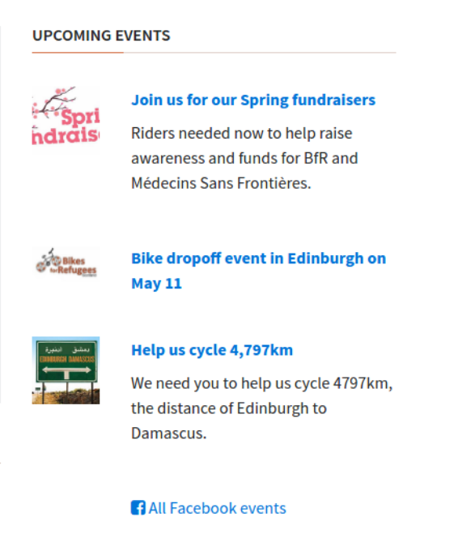

# HTML/CSS 2
**What will we learn today?**
- Responsive web design
- Media queries
- Content layout: flexbox
- Content layout: floats (maybe)
- Content layout: relative and absolute positioning (maybe)
---

## Content Layout: Flexbox

<<<<<<< HEAD
> **Exercise:** (Pair programming) Look at [this Codepen](http://codepen.io/natewr/pen/aJPOeR) which uses flexbox. Try to understand how it is working.
=======
Flexbox is a name for a set of CSS layout rules which are supported in newer browsers. They allow you to apply rules to elements to place them side-by-side and re-arrange them. You just specify how you want your elements arranged and the browser will scale this arrangement depending on the screen size and device used for viewing.

Most flexbox rules are applied to the container, to tell it how to arrange its children. However, there are some rules that can be applied to children as well.

You can see all the rules that can be applied to both the container and the children here:
https://css-tricks.com/snippets/css/a-guide-to-flexbox/

> **Exercise:** Continue editing the "Bike for refugees" website by adding 3 boxes below Jumbotron, and using Flexbox, make sure they are arranged like in the sketch below:

If you finish early, you can add some text in each box and position it in the middle of the box.

> **Exercise:** Working independently, try to position the articles and images side-by-side under the "Upcoming Events" section. Use [this screenshot](assets/screenshot-complete.png) to guide you. If you get stuck, go ahead and ask your partner. Never be afraid to ask!
Hint: you might need to create a container for the text pieces!
>>>>>>> origin/scotland

Often you will need to place a "gutter" between objects that sit side-by-side. A "gutter" is a small amount of open space between two columns. Read about the [justify-content](https://css-tricks.com/almanac/properties/j/justify-content/) property.

> **Exercise:** Add a small gutter between the two articles under the "Learn More" section of the `bikes for refugees` website that you have already forked on your personal Github account.

<<<<<<< HEAD
Read this short article on the [align-items](https://css-tricks.com/almanac/properties/a/align-items/) property. Try out some of the different properties on your "Learn More" boxes to see how they effect the size of the boxes.

> **Exercise:** The sidebar in your `bikes for refugees` site is [broken](assets/broken-sidebar.png). Fix it to match this using Flexbox:

## Homework
1. (Est. 1-2 hours) Complete the "Common Responsive Patterns" lesson of the [Responsive Web Design Fundamentals](https://www.udacity.com/course/responsive-web-design-fundamentals--ud893) course.
2. (Est. 1-2 hours) Complete as many levels of the [Flexbox Froggy](http://flexboxfroggy.com/) game as you can. This will stretch your knowledge of Flexbox and you may need to do some research. It's ok if you can't complete all levels. Do as many as you can.
3. Go back to your fork of the Project repo - https://github.com/Code-Your-Future/html-css-project - Revisit the webpage you created in last week's homework assignment. Add a sidebar to your site and move the site description into it. This should appear below the articles on small screens, then switch to a two-column layout with the articles and sidebar sitting side-by-side. Add at least three more articles and then convert them to a grid, so that you show 3 articles per row in a box layout.
4. (Est. 2-3 hours) Create your own CSS library! You can re-use the styles from one project across all your projects by sharing the same CSS file across all of them! Start by forking [this repository](https://github.com/Code-Your-Future/css-skin) into your repository. Your goal is to add the necessary CSS style for the buttons to match the images next to them, according to [this page](https://code-your-future.github.io/css-skin/).
=======
## Homework
1. (Est. 1-2 hours) Complete the "Common Responsive Patterns" lesson of the [Responsive Web Design Fundamentals](https://www.udacity.com/course/responsive-web-design-fundamentals--ud893) course.
2. (Est. 1-2 hours) Complete as many levels of the [Flexbox Froggy](http://flexboxfroggy.com/) game as you can. This will stretch your knowledge of Flexbox and you may need to do some research. It's ok if you can't complete all levels. Do as many as you can.
3. (Est. 3 hours) Complete as many levels as you can from [Flexbox Zombies](http://flexboxzombies.com/)
4. (Est. 2-3 hours) Continue working on the webpage you created in last week's homework assignment. Add a sidebar to your site and move the site description into it. When viewing on a small screen, this should appear below the articles. On a larger screen, it should switch to a two-column layout with the articles and sidebar sitting side-by-side. Add at least three more articles and then convert them to a grid, so that you show 3 articles per row in a box layout.
5. (Est. 1-2 hours) Flexbox is relatively new and is not supported in older browsers. In most of your work, you'll use Flexbox. But an employer might want you to use one of the older layout strategies. Read this article to learn about [positioning content in CSS](http://learn.shayhowe.com/html-css/positioning-content/) using floats and absolute positioning.
>>>>>>> origin/scotland

## Prepare for the next class
1. (Est. 1 hour) You may remember Bootstrap from your application process. Look at the documentation for [Bootstrap 4](https://v4-alpha.getbootstrap.com/) and look at their examples to see how they are building components.
