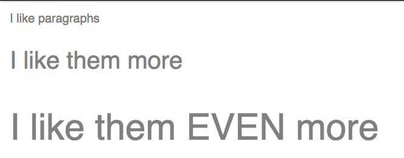

# HTML/CSS 3
<<<<<<< HEAD

What we will learn today:

- [Design frameworks](#design-frameworks)
- [Naming patterns](#naming-patterns)
- [CSS processors](#css-processors)

## Naming patterns
=======
- Design frameworks
- Bootstrap 4 and HTML/CSS frameworks
- HTML forms
- Git branching and pull requests
- Naming patterns (OOCSS, BEM)
---

## Design Frameworks

A design framework is a collection of re-usable code snippets which you can use to build a website. It is sometimes called a "design system", "style guide", or "pattern library", and will usually consist of three things:

1. **Brand guidelines** define the appropriate typography, colors and logos to use.
2. **Components** define re-usable code snippets for common requirements, like navigation menus.
3. **Helpers** define additional code tools to construct the site, like layout grids.

The main goals of a design framework are to ensure design consistency and avoid writing the same code twice.

The BBC's Global Experience Language is a design framework. It calls it's components [design patterns](http://www.bbc.co.uk/gel/guidelines/category/design-patterns) and in the [foundations](http://www.bbc.co.uk/gel/guidelines/category/foundations) section you'll find discussion of layouts and typography.

> **Exercise:** Look at the [Promos](http://www.bbc.co.uk/gel/guidelines/promos) design pattern. As a group, let's try to name all the parts of a Promo that we'll need to consider when designing the component? Now do the same with the [Carousel](http://www.bbc.co.uk/gel/guidelines/carousel) pattern.

## Open-source HTML/CSS/JS Frameworks

[Bootstrap](https://v4-alpha.getbootstrap.com/) and [Foundation](http://foundation.zurb.com/) are popular examples of open-source HTML/CSS/JS frameworks. They help you construct your own design framework by providing a number of re-usable components that are common for web applications.

Bootstrap is CSS and JavaScript code that we [load in our HTML pages](https://v4-alpha.getbootstrap.com/getting-started/introduction/). Bootstrap's documentation describes how to write HTML code that fits the Bootstrap components, including a [grid layout](https://v4-alpha.getbootstrap.com/layout/grid/) as well as several [components](https://v4-alpha.getbootstrap.com/components/alerts/).

> **Exercise:** Fork [this repository](https://github.com/NateWr/groupstrap) and follow the instructions in the [readme](https://github.com/NateWr/groupstrap) to create a new page and add a card component to it.

> **Exercise:** Perform a group exercise illustrating git branching and pull requests. Then create a branch, commit your new page, and issue a pull request. Once all the pull requests are merged, switch back to the `master` branch and update your copy.


<<<<<<< HEAD

## Homework
1. If you haven't already, fork the [`css-skin`](https://github.com/Code-Your-Future/css-skin) repository. If you have already forked it, you can use your fork for this exercise.

    - Open `index.html` and look at the images of how your buttons should look like, and then notice the unstyled buttons above.
    - The unstyled buttons have classes. Use them to write your css in `skin.css`, so the buttons receive a style. Go for maximum reusability. Try not to repeat code!
    - Add more HTML examples, following the same naming pattern as the buttons - for example, a list (`ul`) with items (`li`). Add more than one sytle of element (for example a `ul` that displays the elements vertically and other that displays them horizontally).
    - Write the CSS for those elements.
    - As usual, make a pull request and send them to one of the mentors for review!

2. Read about [writing loops in SCSS >](http://clubmate.fi/for-while-and-each-loops-in-sass/) (Sass). Fork this CodePen into your account: https://codepen.io/claudiamm/pen/xdjadV. You have three paragraphs, each with a different `paragraph-size` class. First, write the common styles (`color`, etc) for all paragraphs. Use a SASS `for` loop and nesting in order to create the `paragraph-size-1/2/3` styles. The final result should look like this:

    

    Note: the aim of this exercise is to do a for loop - so please **do NOT** do something like below, as it will not bring you anything new:

    ```
    .paragraph-size-1 {...}
    .paragraph-size-2 {...}
    .paragraph-size-3 {...}
    ```

    **Tip:** you can multiply! `$i * 10px;`

### Optional homework

3. Use SASS in your `css-skin` project instead of normal CSS. Suggestion: alongside `skin.css`, create a file called `skin.scss`. You will use SASS to transform (compile) your SCSS file into a CSS file caled `skin.min.scss`. [How to compile SASS with VS Code >](https://code-your-future.github.io/syllabus-london/html-css/compile-scss-instructions)

4. Make your `css-skin` project available under `yourname.github.io/css-skin`, as so you can access `skin.css` via `yourname.github.io/css-skin/skin.css`.
    - Go back to a website that you have made for CodeYourFuture (either for homework or the one that you built when applying).
    - Import your `skin.css` file using `<link rel="stylesheet" href="http://yourname.github.io/css-skin/skin.css" />`.
    - You can use your buttons and lists in this website too. Give it a try by adding the following code to your page `<button class="btn">Button</button>`.
    - You've got your own CSS framework now! Use it in your future projects for CodeYourFuture, and update it with new elements when needed. This will help you to build your Github portfolio.

## Reading

- [Getting started with SASS >](https://scotch.io/tutorials/getting-started-with-sass)
- [SASS basics >](http://sass-lang.com/guide)
=======
## Homework

- Look at as much of the [Bootstrap 4 Documentation](https://v4-alpha.getbootstrap.com/) as you can.
- Add Bootstrap to the website you've been building for your homework.
- Add a new HTML page to the website you've been building for your homework. Use Bootstrap's form components to a contact form to this page.
- Modify the articles in the website you've been building for your homework. Modify their markup to use the BEM naming pattern so that they all look the same.

## Resources

- [HTML Forms](http://marksheet.io/html-forms.html) at Marksheet.io
- [Building Forms](http://learn.shayhowe.com/html-css/building-forms/) at ShayHowe.com
- [Bootstrap 4 Documentation](https://v4-alpha.getbootstrap.com/)
>>>>>>> origin/scotland

## Prepare for next class

Next week, we will begin learning and programming JavaScript. To prepare for the next lesson:

<<<<<<< HEAD
Watch these videos:

1. ['What is JavaScript?'](https://www.youtube.com/watch?v=nItSSTwBvSU)
2. ['Do You Know the History of JavaScript?'](https://www.youtube.com/watch?v=EUAmiIsp2YU)
=======
Watch this 2 minutes video:

1. ['What is JavaScript?'](https://www.youtube.com/watch?v=nItSSTwBvSU)
>>>>>>> origin/scotland
