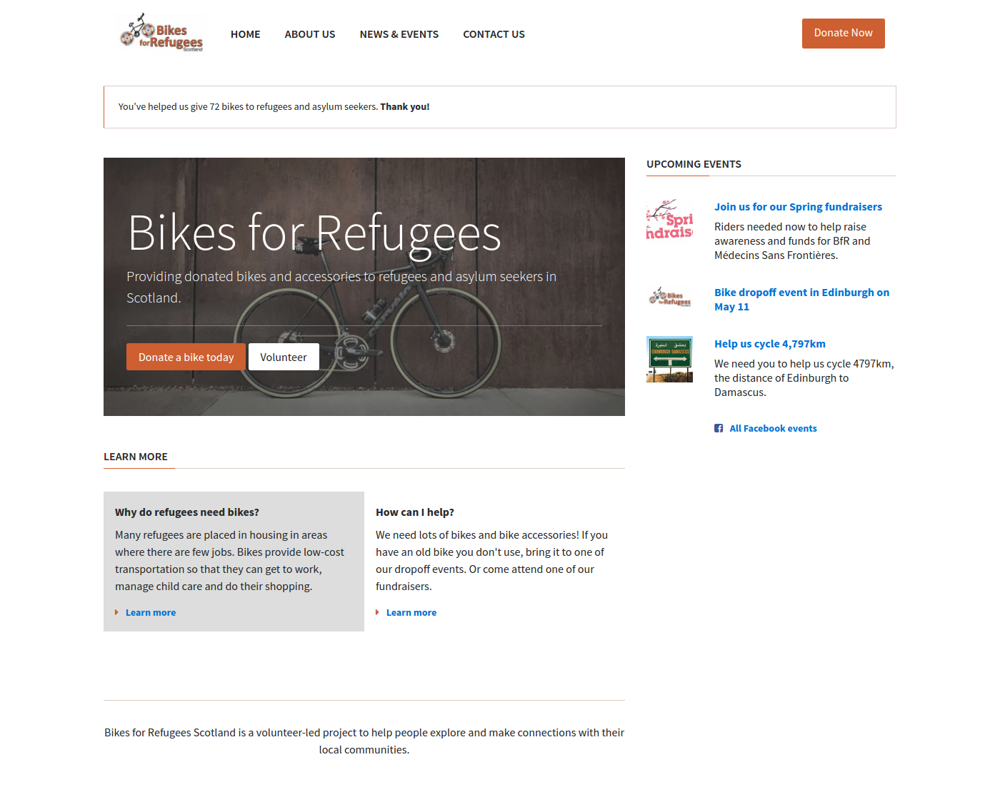

# Semantic HTML tags

## What makes a web page?


**Separation of Concerns:** In computer science, separation of concerns (SoC) is a design principle for separating a computer program into distinct sections, such that each section addresses a separate concern. (Wikipedia)

> **Principles** - During the course, we will highlight principles that apply to the specific topic but also to Computer Science and Programming in general. It is important to understand these principles, terms and apply them to your thinking in general.

## HTML Syntax

You're already familiar with HTML code from your application process. If you want to refresh your memory, read this [quick guide to the HTML syntax](http://marksheet.io/html-syntax.html).

All together, let's review the basic syntax in the following example:

```
<article>
    <h1>Learning HTML</h1>
    <p>Get to know the HTML basics.</p>
    <a href="http://html5rocks.com">Read Article</a>
</article>
```

> **Exercise** Which parts are the **Tags** and which parts are the **Attributes**.

HTML tags are arranged in a hierarchy. This is sometimes called "nesting" tags or creating an HTML "tree". Between the opening `<article>` tag and the closing `</article>` tag there are three other tags. We call these "child" tags, because they have a parent-child relationship.


> **Exercise** As a group, let's try to name all of the parent and child tags in the following example.

```
<article>
    <h1>Learning HTML</h1>
    <p>
        <span class="author">Author:</span>
        <a href="http://codeyourfuture.co">Code Your Future</a>
    </p>
    <p>Get to know the HTML basics.</p>
    <a href="http://html5rocks.com">Read Article</a>
</article>
```

## Example HTML/CSS Project

In today's class, we will begin adapting styles on this example website. We'll review some of the HTML/CSS basics you already encountered during your application process and learn some new techniques. By the end of the third lesson, we will have worked together to improve the example site on the left so that it looks like the screenshot on the right.

<a href="assets/screenshot-start.png" target="blank">
  
</a>
<a href="assets/screenshot-complete.png" target="blank">
  
</a>

## Semantic HTML

When writing HTML code, you can use different tags to describe the content. Is it a navigation menu, a paragraph of text, or an article? By using the correct tag, you help search engines like Google or screen readers for the visually impaired.

> Semantic HTML is the use of HTML markup to reinforce the semantics, or **meaning**, of the information in webpages and web applications rather than merely to define its presentation or look. [Wikipedia](https://en.wikipedia.org/wiki/Semantic_HTML)

We'll cover the following semantic tags:

  - ``<header>``
  - ``<footer>``
  - The ``role="main"`` attribute
  - ``<nav>``
  - ``<article>``
  - ``<aside role="complementary">``

> **Exercise (pair programming):**  Switch between the person who is driving and the one who is helping out. The person who is now driving will `fork` the repository and `clone` it to their computer. Add the gray section with the text 'Bikes for Refugees' and the two buttons. Update the website to use semantic tags.

# Resources
1. [HTML5 - semantic elements](https://developer.mozilla.org/en/docs/Web/Guide/HTML/HTML5)
