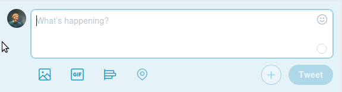
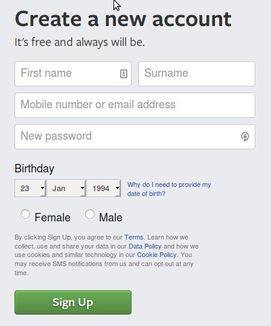
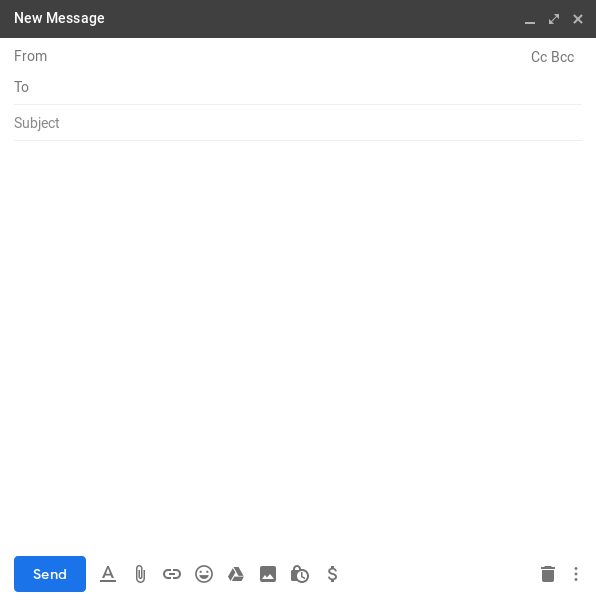

# HTML/CSS 3

What will we learn today?

- [What are forms?](#what-are-forms)
- [The HTML Form](#forms)
- [Fields](#fields)
- [Labels](#labels)
- [Buttons](#buttons)
- [More Field Types](#more-field-types)
- [Accessibility](#accessibility)
- [Fieldsets](#fieldsets)
- [Form Attributes](#attributes)
- [Git Merge Conflicts](#merge-conflicts)
- [Retrospective](#retrospective)

## <a name="what-are-forms"></a>What are forms?

Forms are used everywhere on the web. You use them every day when you log into Slack, send an email, post to Facebook or sign up for services. Any time you enter information into a website, you are using a form.

> **Group Exercise**: Look at the forms below. Can we identify the fields, labels and buttons that are used in these forms?








## <a name="forms"></a>The HTML Form

A form always starts with a `<form>` tag and ends with `</form>`. The `action` attribute is used to tell the form where to send the data.

The example below submits the form to Google's search engine.

```html
<form action="https://www.google.com/search">
  ...
</form>
```

The `method` attribute can be set to `GET` or `POST`. Use `GET` when the user is requesting information from the server. Use `POST` when the user is sending information to the server.

Some examples of forms and the most common `method` they will use:

| Purpose | Most Common Method |
| --- | --- |
| Search for something | `GET` |
| Send a message | `POST` |
| Edit your profile | `POST` |
| Login | `POST` |
| Create account | `POST` |

When we search on Google, we are requesting information. We should use the `GET` method.

```html
<form method="GET" action="https://www.google.com/search">
  ...
</form>
```

## <a name="fields"></a>Fields

Forms ask the user to enter information. To do this, users need HTML elements where they can type, select, check or click to provide information. We call these elements "fields".

The most common fields are `<input>`, `<textarea>` and `<select>`.

```html
<input type="text" name="search-query">
```

<input type="text">

---

```html
<textarea name="message"></textarea>
```

<textarea name="message"></textarea>

---

```html
<select name="country">
  <option>Brazil</option>
  <option>Croatia</option>
  <option>Ethiopia</option>
  <option>Laos</option>
  <option>Uganda</option>
</select>
```

<select name="country">
  <option>Brazil</option>
  <option>Croatia</option>
  <option>Ethiopia</option>
  <option>Laos</option>
  <option>Uganda</option>
</select>

---

Each field must have a unique `name` attribute. If two fields share the same `name` attribute, the value of one will be dropped when the information is sent.

Field elements should be nested inside of a `<form>` element.

```html
<form method="GET" action="https://www.google.com/search">
  <input type="text" name="search-query">
</form>
```

## <a name="labels"></a>Labels

Labels are used to tell the user what information they should put into each field. Fields can be nested inside of a `<label>` to link the information with the field.

```html
<label>
  Username
  <input type="text" name="uid">
</label>
```

Sometimes you want to keep the `<label>` and the `<input>` separate. In that case, labels and fields can be linked together with the `for` and `id` attributes.

```html
<label for="username">Username</label>
<input id="username" type="text" name="uid">
```

Every field _must_ have a `<label>`. A field that does not have a `<label>` can not be used by someone with a visual impairment, even if it has other text to describe it.

## <a name="buttons"></a>Buttons

Buttons are used for many things. The most common purpose is to submit a form. When used to submit a form, they must have a `type` attribute with a value of `submit`.

```html
<button type="submit">Search Now</button>
```

<button type="submit">Search Now</button>

When a user clicks on a submit button, the information in the form is sent to the form's `action` attribute.

```html
<form method="GET" action="https://www.google.com/search">
  <button type="submit">Search Now</button>
</form>
```

<input type="text" name="search-query">
<button type="submit">Search Now</button>

---

Complete exercises 19, 20 and 21 from week 3 of the [HTML, CSS and Git Exercises](https://github.com/CodeYourFuture/html-css-git-exercises).

## <a name="more-field-types"></a>More Field Types

### Different kinds of text

There are many `<input>` types that can be used to collect different information, such as phone numbers, email addresses, numbers and more. Here are some examples.

- Phone Number: `<input type="tel" name="phone">`
- Email Address: `<input type="email" name="email-address">`
- Numbers: `<input type="number" name="age">`
- URL: `<input type="url" name="website">`
- And [several more](https://developer.mozilla.org/en-US/docs/Web/HTML/Element/input#Form_%3Cinput%3E_types).

Each `<input>` type identifies what kind of information should be entered. For example, phones will show different keyboards depending on if you are entering a phone number, a URL, or an email address.

> Want to learn more? Read about [all of the input types](https://www.smashingmagazine.com/2019/01/html5-input-types/).

### Checkboxes

A checkbox allows the user to say yes or no to an option. With a checkbox, the user does not type the value into the field. You have to provide the value in a `value` attribute.

```html
<label>
  <input type="checkbox" name="signup" value="yes">
  Would you like to receive discounts by email?
</label>
```

<label>
  <input type="checkbox" value="yes" name="signup">
  Would you like to receive discounts by email?
</label>

---

Checkboxes that are related to each other can be grouped together in a `<fieldset>`. A group of fields is described by a `<legend>`.

```html
<fieldset>
  <legend>What languages do you speak?</legend>
  <label>
    <input type="checkbox" name="language" value="ar">
    Arabic
  </label>
  <label>
    <input type="checkbox" name="language" value="es">
    Spanish
  </label>
  <label>
    <input type="checkbox" name="language" value="en">
    English
  </label>
</fieldset>
```

<fieldset>
  <legend>What languages do you speak?</legend>
  <label style="margin-right: 1em;">
    <input type="checkbox" name="language" value="ar">
    Arabic
  </label>
  <label style="margin-right: 1em;">
    <input type="checkbox" name="language" value="es">
    Spanish
  </label>
  <label>
    <input type="checkbox" name="language" value="en">
    English
  </label>
</fieldset>

---

> **Group Discussion**: Checkboxes are an exception to the rule that every field must have a unique `name` attribute. In the example above, all three checkboxes have the same `name` attribute. What do you think will happen when more than one checkbox is selected?

### Radio Buttons

Radio buttons are just like checkboxes, except the user can only select one option.

```html
<fieldset>
  <legend>What is your preferred language?</legend>
  <label>
    <input type="radio" name="language" value="ar">
    Arabic
  </label>
  <label>
    <input type="radio" name="language" value="es">
    Spanish
  </label>
  <label>
    <input type="radio" name="language" value="en">
    English
  </label>
</fieldset>
```

<fieldset>
  <legend>What is your preferred language?</legend>
  <label style="margin-right: 1em;">
    <input type="radio" name="language" value="ar">
    Arabic
  </label>
  <label style="margin-right: 1em;">
    <input type="radio" name="language" value="es">
    Spanish
  </label>
  <label>
    <input type="radio" name="language" value="en">
    English
  </label>
</fieldset>

---

Complete exercises 22, 23 and 24 from week 3 of the [HTML, CSS and Git Exercises](https://github.com/CodeYourFuture/html-css-git-exercises).

## <a name="accessibility"></a>Accessibility

All fields must have a `<label>` and all fieldsets must have a `<legend>`. Sometimes you will have a form field that doesn't need a label. For example, a search field is often identified with an icon and a `placeholder` attribute.

```html
🔍 <input type="search" placeholder="Search">
```

🔍 <input type="search" placeholder="Search">

This is clear for most users, but not for the visually impaired, who use a screen reader to browse the web. These users can not see the icon next to the field and their assistive technology may not read out the `placeholder` text.

You _must_ add a `<label>` in order to be accessible to all users.

```html
<label for="search-input">Search</label>
🔍 <input type="search" placeholder="Search" id="search-input">
```

<label for="search-input">Search</label>
🔍 <input type="search" placeholder="Search" id="search-input">

For sighted users, it now looks like there are two labels. In these circumstances, we use special CSS code to visually hide the label.

HTML:

```html
<label for="search-input" class="screenreader">Search</label>
🔍 <input type="search" placeholder="Search" id="search-input">
```

CSS:

```css
.screenreader {
  clip: rect(1px, 1px, 1px, 1px);
  position: absolute !important;
  left: -2000px;
}
```

<label for="search-input" class="screenreader" style="clip: rect(1px, 1px, 1px, 1px); position: absolute !important; left: -2000px;">Search</label>
🔍 <input type="search" placeholder="Search" id="search-input">

> **Group Discussion**: What are our obligations as software developers to make sure everyone can access the websites we build? How might people suffer if they can't access the web?

## <a name="fieldsets"></a>Fieldsets

Fieldsets can be used for any fields that are grouped together. This is often used to distinguish two groups of similar fields.

```html
<fieldset>
  <legend>Mother</legend>
  <label for="mother-given">Given Name</label>
  <input type="text" name="mother-given" id="mother-given">
  <label for="mother-family">Family Name</label>
  <input type="text" name="mother-family" id="mother-family">
</fiedset>
<fieldset>
  <legend>Father</legend>
  <label for="father-given">Given Name</label>
  <input type="text" name="father-given" id="father-given">
  <label for="father-family">Family Name</label>
  <input type="text" name="father-family" id="father-family">
</fiedset>
```

<fieldset>
  <legend>Mother</legend>
  <label for="mother-given">Given Name</label>
  <input type="text" name="mother-given" id="mother-given">
  <label for="mother-family">Family Name</label>
  <input type="text" name="mother-family" id="mother-family">
</fiedset>
<fieldset>
  <legend>Father</legend>
  <label for="father-given">Given Name</label>
  <input type="text" name="father-given" id="father-given">
  <label for="father-family">Family Name</label>
  <input type="text" name="father-family" id="father-family">
</fieldset>

---

Complete exercises 25 and 26 from week 3 of the [HTML, CSS and Git Exercises](https://github.com/CodeYourFuture/html-css-git-exercises).

## <a name="attributes"></a>Form Attributes

There are many attributes you can use on `<input>`, `<textarea>` and `<select>` fields.

### Required

A field with the `required` attribute will not allow the form to be submitted until the user has entered information.

```html
<input type="password" name="pw" required="required">
```

### Value

The `value` attribute can be added to an `<input>` field to pre-fill information. This is often used when a website remembers your username during login.

```html
<input type="text" name="username" value="hotshot777">
```

<input type="text" name="username" value="hotshot777">

### Readonly

The `readonly` attribute can be added to `<input>`, `<textarea>` and `<select>` fields to prevent the user from making changes to the field.

```html
<input type="text" name="city" value="Glasgow" readonly="readonly">
```

<input type="text" name="city" value="Glasgow" readonly="readonly">

### Checked

The `checked` attribute can be added to a checkbox or radio button to pre-check the field. This is often used to select a default that the user may not want to change.

```html
<fieldset>
  <legend>What languages do you speak?</legend>
  <label>
    <input type="checkbox" name="language" value="ar">
    Arabic
  </label>
  <label>
    <input type="checkbox" name="language" value="es">
    Spanish
  </label>
  <label>
    <input type="checkbox" name="language" value="en" checked="checked">
    English
  </label>
</fieldset>
```

<fieldset>
  <legend>What languages do you speak?</legend>
  <label style="margin-right: 1em;">
    <input type="checkbox" name="language" value="ar">
    Arabic
  </label>
  <label style="margin-right: 1em;">
    <input type="checkbox" name="language" value="es">
    Spanish
  </label>
  <label>
    <input type="checkbox" name="language" value="en" checked="checked">
    English
  </label>
</fieldset>

Complete exercise 27 from week 3 of the [HTML, CSS and Git Exercises](https://github.com/CodeYourFuture/html-css-git-exercises).

## <a name="merge-conflicts"></a>Git Merge Conflicts

Last week you used Git to merge your changes from one branch back into your master branch.


Sometimes Git can not automatically merge one branch into another, because each branch has modified the same line of code. Git does not know which version of the line is the correct one. When this happens, we have a "merge conflict".


As a developer, you have to tell Git which version of the line of code is correct.

Complete exercise 28 from week 3 of the [HTML, CSS and Git Exercises](https://github.com/CodeYourFuture/html-css-git-exercises) to learn how to resolve a merge conflict.

## <a name="retrospective"></a>Retrospective

At the end of each module, we'll have a retrospective. What went right? What went wrong? What do we need to do as a group to learn better? Let's discuss the HTML/CSS module.

## Resources

- [HTML Forms](http://marksheet.io/html-forms.html) at Marksheet.io
- [Building Forms](http://learn.shayhowe.com/html-css/building-forms/) at ShayHowe.com


