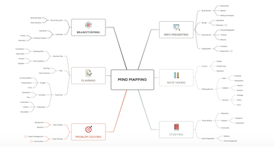
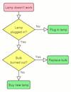
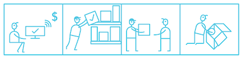

# Introduction 1

TODO

## Effective Learning Strategies

Here are some strategies for learning that scientists and psychologists have found to be effective.

### Active Learning vs Passive Learning

Try to do more active learning than passive learning as it is more effective.

| Passive | Active |
| - | - |
| Reading about something | Completing exercises |
| Watching a video | Code-along (typing code along with the video) |
| Listening to a lecture | Making notes during the lesson |

### Space out your studying

If you can, don't cram all of your studying into 1 day, it's better to try to spread it out over multiple days.

When you are studying, switch between different topics that you have learnt about. Try reviewing your notes from week's class then switch to go over last week's exercises and see if you can improve them with feedback from your teachers.

Here's an example of a good schedule:

| Monday | Tuesday | Wednesday | Thursday | Friday | Saturday | Sunday |
|:-:|:-:|:-:|:-:|:-:|:-:|:-:|
| Review notes from the class | Do some homework exercises | Break | Review feedback on previous homework | Complete homework exercises | Break | Lesson |

### Make notes

During the lessons, bring a notepad and write notes about what you are learning. When you are at home, you can review your notes if you get stuck.

When reviewing your notes, try drawing diagrams that explain and summarise your notes. This helps make connections between concepts. Here are some examples of diagrams you could draw:

**Mindmap**

**Flowchart**

**Cartoon Strip**

You can also try making flash cards, which you can use to practice remembering things from your notes. Cut up some paper into small cards, then write a question or prompt one side and the answer on the other side.

When you have some free time (for example, when on the bus to work!) bring your flash cards and try to answer the questions without looking at the answer. You could even swap your flash cards with a friend to see if there's something you missed from your questions/answers.

### Explain to others

Ask yourself questions while you are studying about how things work and why. Try to explain it to yourself or to a friend, which really helps your understanding. Many of the teachers at CYF volunteer because they get better by explaining programming to you.

As you are asking yourself questions or explaining, try to think of real-life examples of where you might come across this problem. This helps you connect ideas together so that you can remember them more easily.

### Get enough sleep

Your ability to think drops by 25% for each 24 hours you’re awake. Because of this, it is much less effective to stay up all night studying than to study when you have had enough sleep.

Try making a diary or calendar of all the things you need to do, and include some time for studying. A todo list is also a good tool for prioritising what needs to be done first. You could use a paper notebook or there are lots of good online tools for helping you with this.

### Don't try to multitask

Don't try to multitask when studying, turn off distractions and focus on what you are doing. This helps you to be the more productive, so you can do more in less time. It can take up to 10 minutes to get back into your work after you are distracted.

Many programmers like listening to music while they are coding. [freeCodeCamp Radio](https://coderadio.freecodecamp.org/) plays free music all-day for you to listen while programming.
