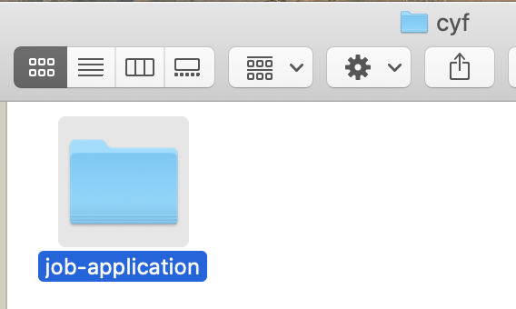
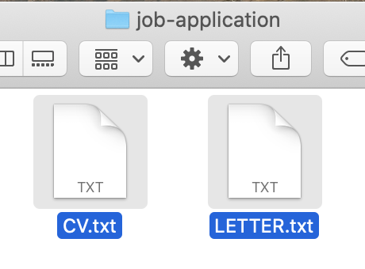
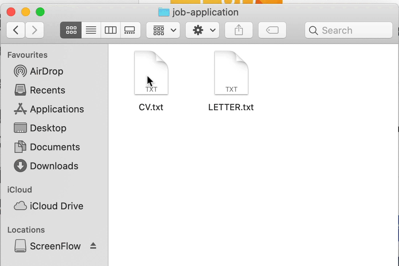
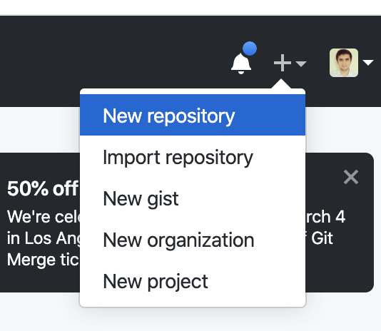
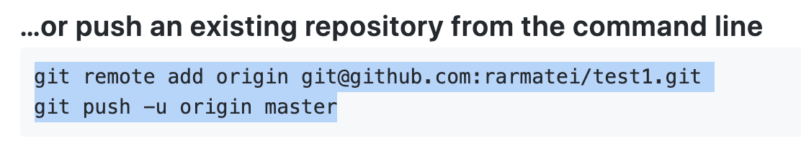

# Introduction to Git

Let's say you're working on an application for a job. You're inside a folder..



And create some new files for my CV and cover letter:



You add some starting text to both files:



This is your blank canvas. You are ready to start writing!

You make a lot of changes to both files. You now have a full cover letter, a full CV, with experience, education etc. But you realise:

- you have lost your starting "template", that had a blank CV and cover letter. If you wanted to apply for a new job you would have to re-create the folder again and prepare both files again
- if you make some changes to your CV, save them, turn off your computer, and the next day you realise you don't need them anymore, it will be really hard to undo them. You need to remember exactly what you changed, and only remove those changes.

What we really want is to save occasional "[snapshots](https://www.merriam-webster.com/dictionary/snapshot)". As we're working through our job application, we want to take a "photo" of our folder each time we make an important change, so we can go back to it if we need to.

So let's say our next task is to add a "Skills" section to our CV. We'll start by adding some skills, maybe decide to remove some, then add some more skills again, but once we're done and satisfied that we completed the task, we'll [commit](https://www.merriam-webster.com/dictionary/commit) to being definitely done (which means we can "take a snapshot" of our folder).

> First word of the day:
> **commit**

So let's do that (go [here](https://youtu.be/YSazjz1IpOc) to play the video from the beginning):


As you can see, each time we commit to finishing a task, we create a new folder, give it the name of our task (so we can find it easier), and copy all our files in it.

We now have these folders:


The selected one, `job-application`, is our **latest** one. It is the one that has all the latest changes and is the most up to date. The other ones, contain different [milestones](https://www.merriam-webster.com/dictionary/milestone) of our work, and they're named accordingly! There's a folder for our initial template (right before we first started writing) another one for when we added "Education" to our CV etc.

Now let's say that while working on our job application, we get a message about an even better job! So we pause our current work, and open our `initial-job-application` folder so we can adapt our CV and cover letter for the new job.

Or let's say we send our CV to a friend to review. They tell us they like everything, except the "Skills" section. So we open up the folder right before we added the skills, copy the files in there to our `job-application` folder and start again.

Snapshots are really powerful! They're like a time machine! The names you give to your folders are also kind of important! (they help you know what is what)

---

But each time we finished a task, we've been copying ALL of the files to the new folder. What if we're not ready to copy all files? What if we've added a "References" section in our CV, and it looks good, and we also changed the cover letter a bit - but we're not quite ready to commit the cover letter.

Well, we can **add** only the files we want to our commit. We'll copy just the CV to the new folder, and instead of copying the latest version of the cover letter, we'll just get it from the previous folder we committed.

> Our second important word:
> **add**

---

This is all really useful! But a bit annoying to do each time! And we're going to make a lot more changes - which means A LOT more folders. It will get confusing really fast.

Would it not be nice if we had a robot we could ask to do all this work for us? We would just tell it anytime we're ready to commit, and it would create those folders for us, somewhere hidden, where we can't see them! Something like Alexa, or Siri - _"hey Alexa, add these files, I'm ready to commit them!"_

Turns out we do, but our robot is called Git. And whenever we want to use Git in a folder, to track our changes, we need to first tell it to initialize in that folder.

> So our third important word is:
> **init**

To put it all together, the way we'd talk to Git is:

```
git init
git add CV.txt
git commit -m "add skills"
```

Now it's your turn:

1. Create a new folder with [`mkdir`](https://manpages.ubuntu.com/manpages/bionic/en/man1/mkdir.1posix.html)
2. `cd` to that folder
3. run `git init`
4. create a simple CV file
5. `add` it to be committed
6. `commit` it with a message
7. create a cover letter file
8. `add` it to be committed
9. `commit` it with a message
10. now make some changes to both files
11. `add` both files to be committed
12. `commit` your change with a message

---

Remember how we created all those directories? They don't seem to appear here, where is git storing them? Well, when you run `git init`, Git actually created a hidden folder and puts all your snapshots in there.

So how can we see what we committed if it's all hidden away? Try:

`git log`

You'll see the list of your commits, in the order you made them!

How about if you make changes to some files, you're ready to commit, but you forgot which ones you changed. How do you add them? Try:

`git status`

You'll see a list of files. Their colour is important:

 **RED**  --> they've been changed, but are not _added_ yet, so will not be part of the next commit

 **GREEN**  --> they've been changed AND added to be part of the next commit

So let's practice:

1. Make some changes to your CV
2. use `git status` and see what appears (notice the red file)
3. `add` the CV to be part of the next commit
4. use `git status` again (notice how it's now green)
5. `commit` it with a message
6. use `git status` (there should be no files now)
7. change CV again
8. `add` it to be part of the next commit
9. now change the Cover Letter
10. use `git status` (notice how one is green and one is red)
11. `commit` with a message
12. use `git status` (notice how there's only the red Cover Letter now)
13. `add` the Cover Letter and `commit`
14. use `git status` (notice how you have no files)
15. use `git log` to see what changes you made

---

Finally, let's share our work with our friends! We'll use [GitHub](https://github.com/) for this.

1. Go to [https://github.com](https://github.com) and create a new account
2. Create a new repository



3. Copy the commands it gives you and run them in the terminal



4. run `git push`

> And that is the last important word we'll learn today:
> **push**

---

> **Last Git exercise:**
> Spend 5 minutes to write down what you learned about Git. Use your own words, don't copy/paste the lesson.
