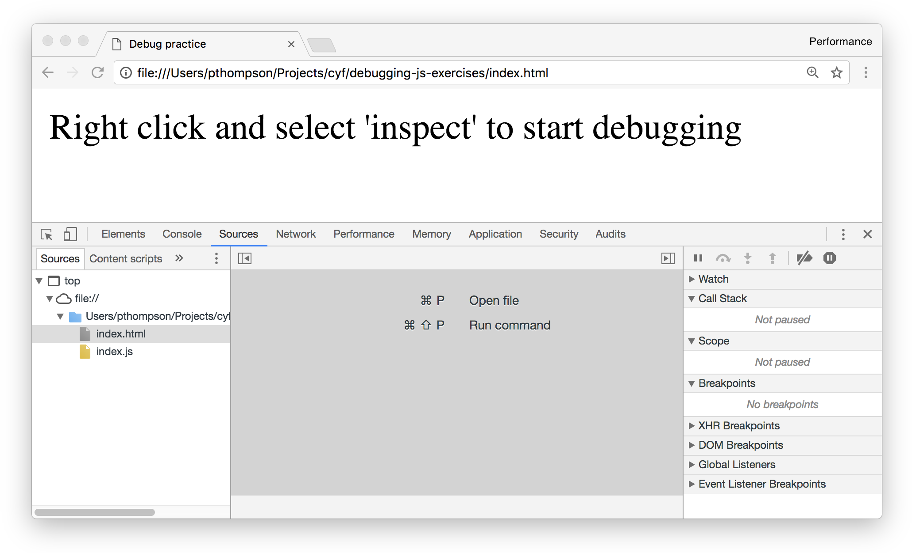

## Debugging
Start by cloning the repo at `https://github.com/codeyourfuture/debugging-js-exercises`. Also, check you have the latest version of Chrome (59). The exercise will still work with older versions, but some parts may look different.

Most code written will contain some errors commonly referred to as bugs. So far we have been using `console.log`s to check our application state. It's a quick and convenient method, but it

1. only shows the state we explicitly ask to show
2. at one location only
3. does not show how we arrived there
4. does not allow custom code execution

Here we will look at debugging which allows us to step through the code and inspect variables as every stage as well as step through the call stack.

Let's open the `index.html` file from `debugging-js-exercises` in Chrome. Launch `Developer Tools` by right clicking in the browser and selecting `inspect`. In `Developer Tools` window open the `sources` tab, it's the 3rd tab from the left.

### Breakpoints
To step through our code we need first to tell the debugger where to stop. The location where the debugger is told to pause execution is called a `breakpoint`.  This can be done in two ways

1. writing `debugger;` in the code
2. clicking on the line number in source panel

### Inspect
Having stopped at a break point we can find out more about what is happening in our application. We can

1. Hover mouse over variables to see their values
2. Inspect the scope and variables in the panel on the right
3. Inspect call stack. This shows which functions have been called to arrive at current breakpoint. We can click on the functions in the call stack to inspect values from those locations.

### Controls
Once a breakpoint is set we can control the execution of the code.

Continue: resume normal code execution until next breakpoint is hit
Step over: move to the next line and pause
Step in: step into function being called and pause
Step out: exit function where execution has been halted and pause

### Error messages and stack traces
When an error occurs in your application, an `error message` and a `stack trace` will be displayed in the `console`. The error message will tell you what went wrong and the stack trace will tell you what functions were executed immediately before the error. The `error message` and `stack trace` will each have information about which file and line of code they refer to. Use this information to help you place your `breakpoints`.

**Key points**
* If you are not sure what your code is doing use a debugger to pause execution before the problem location and step through it line by line and inspect variables as you go.

> **Exercise**
> Open `debug-me.html` file from `debugging-js-exercises` repo using `Chrome`. The JavaScript file being imported and executed has 3 bugs in it. Use the debugger and error messages in console to help you find and fix the bugs.
