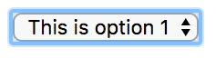
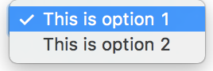
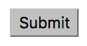

To start a form add a `<form>` tag.
```html
    <form>
    </form>
```

There are different types of elements that can appear inside a form.
The simplest is a text box, or `<input>`

```html
    <form>
        <input type="text" name="myInput">
    </form>
```


You can also add a label to a field (make sure the `for` and `name` match)
```html
    <form>
        <label for="myInput">This is a label:</label>
        <input type="text" name="myInput">
    </form>
```


To create an `select` input field (dropdown)
```html
    <form>
        <select class="" name="mySelect">
            <option value="option1">This is option 1</option>
            <option value="option2">This is option 2</option>
        </select>
    </form>
```
 


To submit a form, you can use an `input` element with the type of `submit`
```html
    <form action="/newpage.html">
        <input type="submit" name="myInput">
    </form>
```


When you press the submit button, the browser will send the data to the page described in the `form`'s
`action` attribute ('/newpage.html' in the above example). If you don't want this behaviour,
you can override it with events!

You can also create buttons, using the `input` type of `button`
```html
<form>
    <input type="button" name="" value="Press me!">
</form>
```


Further reading:
 - [http://htmldog.com/guides/html/beginner/forms/](http://htmldog.com/guides/html/beginner/forms/)
 - [http://www.w3schools.com/html/html_forms.asp](http://www.w3schools.com/html/html_forms.asp)


## Form events
These work in the same way as you have already seen.
You can either add an event as an attribute. For example, when a user clicks away from an input field, you can use the event `onBlur`.
```html
<form>
    <input type="text" onBlur="inputOnBlur(this)">
</form>
```

By adding `this` to the function, we can access the value of the input element, by using `input.value`.

```JavaScript

function inputOnBlur(input) {
    alert(input.value);
}
```

You can also set the value of the element, using the same `value` property.

```JavaScript

function inputOnBlur(input) {
    input.value = 'Some new value';
}
```

## Exercises
1. Create a `select` form, with 4 options for colors (white, blue, green, red). When you `change` the select box, the background color of the page should change.
    
2. Create an `input` form, where you can type in a color, and on `blur` or `change` the background color of the page changes.
    
3. Create an input form, with a button. So that when you type in a color, the background only changes when you click the button.
    (Hint: Use the 'click' event on the button itself)

4. Create two text boxes. After filling in the first text box, when the user fills in the second, and presses a button,
    - If the boxes match, show an alert
    - If the boxes do not match, empty the value in the second box, so the user can try again.

    - Bonus points, for:
        1. Clearing both boxes when the user is correct
        2. Showing a message to the user, under the text boxes, to show they have typed an incorrect/correct word

    