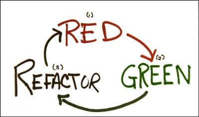

# JavaScript Core 9

**Test Driven Development (TDD)**

- TDD
- BDD
- Let's Test
---

### Test Driven Development (TDD)
> Test-driven development (TDD) is a software development process that relies on the repetition of a very short development cycle: requirements are turned into very specific test cases, then the software is improved to pass the new tests, only. ([Wikipedia](https://en.wikipedia.org/wiki/Test-driven_development))

A key principle in TDD is that we write think about our requirements before we dive into code: What should our program be able to do? What are the small components that make up a larger program?

We put this into practice by first writing a test for a piece of functionality,
before we've even written any code. The test should first fail **RED**. We then
write the code to make the test pass **GREEN**. At this point, we are safe to
refactor the code (clean it up - remove duplication). The process is
**RED-GREEN-REFACTOR**



### Behavioural Driven Development (BDD)

You've already seen the structure of standard unit tests:

```js
test('tick increases count to 1', function() {
  var counter = new Counter();

  counter.tick();

  assert.equal(counter.count, 1);
});
```

While this test is correctly checking that the 'tick' method does indeed work,
it makes assumptions about *implementation* details. For example, this test
assumes that the Counter begins at 0. If we were to change something in the
counter (maybe we want to start it at 10), then it will break the test.

With BDD, we focus on the *behaviour* of a particular unit of code, rather than
the implementation details:

```js
it('should increase count by 1 after calling tick', function() {
  var counter = new Counter();
  var expectedCount = counter.count + 1;

  counter.tick();

  assert.equal(counter.count, expectedCount);
});
```

As you can see, rather than worry about where the Counter has started, we are
only concentrating on the behaviour of the *tick* method, namely that it
increases the Counter by 1.

### Let's Test

We'll be working on the code [Bowling
Kata](https://github.com/CodeYourFuture/bowling-tdd) today to practice TDD.
We can kick off the first part together, then it will be left to you to
continue the test driven development. Please work in pairs!

To start, clone the directory linked above, which will give you the basic file
setup. After cloning, `npm install` and you'll be ready to go.
We'll be testing with Jest.

## Resources
* [9 Benefits of Test Driven Development](https://www.madetech.com/blog/9-benefits-of-test-driven-development)

* [Introduction to Test Driven Development
(TDD)](http://agiledata.org/essays/tdd.html)

## Homework
1. Finish the Bowling Kata that we worked on today. If you have 'finished' it
   in class, continue refactoring it to clean up the code.

## Project
2. [Project time](https://github.com/CodeYourFuture/WebDeveloperTest)

## Prepare for Next Class
Read https://github.com/node-girls/what-is-node and some of the listed resources in preparation for Node/Express next week.

If you have time, take a look at https://medium.com/javascript-scene/introduction-to-node-express-90c431f9e6fd for setting up an Express/node.js server. Don't worry if it is too complicated - this will be the focus of our next few classes.
