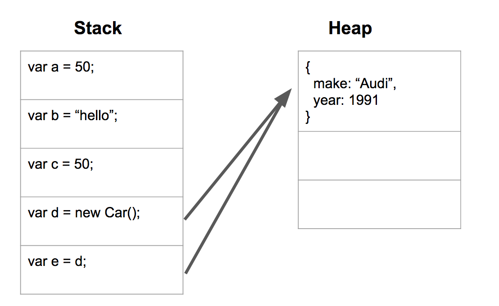

# JavaScript Core 4
** What we will learn today?**
- A taster of Functional Programming


?? maybe Object Oriented JS (prototypes and such),
call, apply etc.. or more algorithmic techniques (recursion etc..)

---

# A taster of functional programming - forEach, map, filter

Consider the following code:

```javascript

var numbers = [1,2,3];

function addTwo(number) {
    return number + 2;
}
```

We have an array of numbers and a function that returns its argument after adding 2 to it.

How would you write a program that adds 2 to each number in the initial array and returns
the result as a new array?

You could do something like this:

```javascript
var result = [];

for(var i=0; i<numbers.length; i++) {

  var current = numbers[i];
  var transformed = addTwo(current);
  result.push(transformed);
}

console.log(result);
```

There is a term for the operation of applying a function to a value and creating a new
value: projection. And it turns out JavaScript arrays come with a simple function to project
them to a new array: the `map` operator.

Let's see how we can re-write the above program using the map function:

```javascript
var result = numbers.map(addTwo);

console.log(result);
```

That's it! We use the map operator on an array and pass to it the function we want
applied to each element in that array. The function can take two parameters: one is the value
that will be transformed, and the second one is the index of the item in the array.

The function passed into is also a..callback!

> **Exercise**:
> Open [this CodePen](http://codepen.io/rarmatei/pen/JWQqoz?editors=0012) and follow the instructions there


## More on objects

Up until now we have created objects using the "literal notation":

```javascript
var myObject = {
  greeting: "hello"  
};
```

Another way to create object is using a function, combined with the `new` keyword:

```javascript
function Cat(name, furColor) {
    this.name = name;
    this.furColor = furColor;
}

var myCat = new Cat('Ron', 'blue');
```

In most cases, using "literal notation" to create a new object will work fine,
however there might be some cases where you want some special initialisation logic to happen
every-time you create a new instance of an object:

```javascript
function Person(firstName, lastName, age) {
    this.fullName = firstName + " " + lastName;
    this.yearOfBirth = (new Date()).getFullYear() - age;
}

var rares = new Person('Rares', 'Matei', 26);

// same object shape as:
var rares2 = {
    fullName: 'Rares Matei',
    yearOfBirth: 1991
};
```

We will get back to this in lesson 4 when discussing about prototypes and inheritance.

> **Exercise**:
> Open [this CodePen](http://codepen.io/rarmatei/pen/aJgxOL?editors=0012) and follow the instructions there


## Value types vs. reference types

A variable can hold two types of values: primitives (value types) and reference types.
The distinction between them is very important and will be a fundamental addition
to your JavaScript arsenal.

Primitives are:
 - string (example: `John Doe`)
 - number (example: `100`)
 - boolean (example: `true` or `false`)


Reference types are:
- Objects (example: `{greeting: "hello"}`)
- Arrays (example: `[1,2,3]`)
- Functions (example: `function doNothing() { }`)

Variables can only hold a few bytes of data.
Because primitives have fixed sizes, when you assign a primitive to a variable,
it will hold the actual value of the primitive (hence the name "value type").
But reference types can have practically infinite sizes, so when you assign a reference type
to a variable, that variable will hold a reference to it only: an identifier which will tell our program
where to look for that object in memory.



Let's make some sense of the above with exercises!

> **Exercise**:
> Open [this CodePen](http://codepen.io/rarmatei/pen/jBjoNL?editors=0012) and follow the instructions there


## Pass by value / reference

Consider the example below.

```javascript

function addFive(value) {
    value = value + 5;
}

var ten = 10;
addFive(ten);
console.log(ten);

```

We have a function that accepts a value as an argument. The function then adds five to the
argument and logs the value.
After invoking the function with the variable `ten`, the variable is logged.

What will be the values logged?
Answer: 10 (not 15)

Explanation:
In JavaScript, variables are always passed to function by value. That means only the value
the variables was holding is passed to the function, and not a reference to the variable's
location in memory. That means that inside a function call, any changes we make to its
arguments will only apply inside the function (as seen in the previous example).

**Be careful though**, as the value of an argument might be a reference to a JavaScript
object, in which case, changing a property on that object will also reflect everywhere
else we use a reference to that object.

For example:

```javascript

function a(primitive, object) {
    primitive = primitive + 5;
    object.greeting = "how are you?";
    object = {
      greeting: "holla!"  
    };
}
var primitive = 10;
var object = {
  greeting: 'hello'  
};
a(primitive, object);
console.log(primitive); // 10
console.log(object.greeting); // "how are you?"
```


# Resources
1. [Pass by value/reference](http://docstore.mik.ua/orelly/webprog/jscript/ch11_02.htm)
2. [Primitive Types and Reference Types](http://docstore.mik.ua/orelly/webprog/jscript/ch04_04.htm)

3. [Callbacks](http://javascriptissexy.com/understand-javascript-callback-functions-and-use-them/)
4. [Creating objects](https://developer.mozilla.org/en-US/docs/Web/JavaScript/Guide/Working_with_Objects#Creating_new_objects)


# Homework

1. First part of Homework - Easy

2. Second part of Homework - Intermediate/Hard

3. **[Bonus/Optional]** Third part/optional - Hardest

4. **Research:**

## Prepare for the next class
1. Read this [Some Tutorial or Video etc...](https://google.com)
