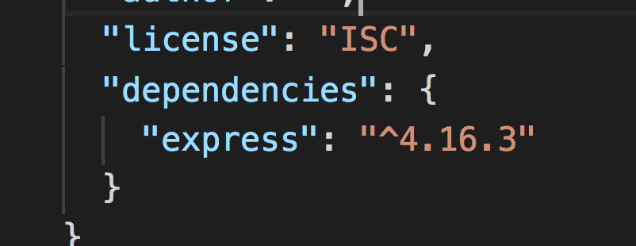
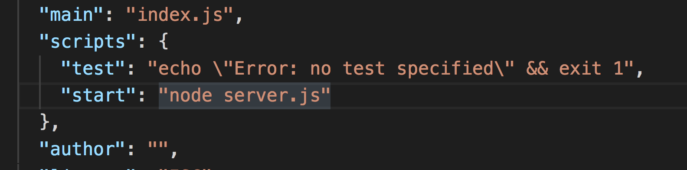
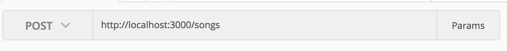

# What did we build so far?

So far, we've been writing JavaScript in the _client_. For the _front-end_.
Remember in our React applications, when we write code like this:

```js
// Part of React Component that gets Beyonce albums data
class BeyonceApp extends React.Component {
  componentDidMount() {
    fetch(
      "https://rawgit.com/rarmatei/f5ae92ac93d9716affab822a3f54f95b/raw/e62641b3f5ddd12c4fe34aa0912488224594e5a7/beyonce-albums.json"
    )
      .then(function(response) {
        return response.json();
      })
      .then(function(data) {
        this.setState({ songs: data });
      });
  }
}
```

Or when we called the Github _API_ to get the number of Repos associated to a user:

```js
var url = "https://api.github.com/users/CodeYourFuture/repos";

fetch(url)
  .then(function(data) {
    return data.json();
  })
  .then(function(repos) {
    var reposList = document.querySelector("#repos-list");
    reposList.innerText = repos.length;
  });
```

What happens in all these scenarios? What is the URL `https://api.github.com/users/CodeYourFuture/repos`? And where does it "live"? Is it on your computer the _client_, or on a remote _server_?

Until now, we have been writing _client_ code (also called _client-side_ or _frontend_). The client in our case is the web browser (e.g. Firefox, Chrome etc.) and it talks to a _server_ (also called _server-side_ or _backend_). In the examples we have completed someone else wrote code to handle server _requests_ and provide a _response_.

We are now taking the next step in our journey: to write _server-side_ code. JavaScript is the only language that the browser understands so you do not have options if you want to write code for the browser (for things like interacting with the DOM and what we have been doing so far).

For the server there are a lot of programming languages you can use: PHP, Python, Java, Ruby, and many more. You'll be pleased to hear that you can also write JavaScript on the server so you don't have to learn another programming language if you don't want to! JavaScript on ther server is relatively new and only started with the introduction of _Node.js_ around 2009. Node.js is what we will use to write server-side code.

> Checkpoint: Do you understand all these terms?

* [ ] Client
* [ ] Server
* [ ] Front-end
* [ ] Back-end
* [ ] Full stack developer

## Get Started

Fork and clone the repo [https://github.com/CodeYourFuture/node-api-workshop](https://github.com/CodeYourFuture/node-api-workshop).

It is an empty project that only includes a `.gitignore` file.

> `.gitignore` will tell Git to ignore certain files or folders and not commit them to the repository.

### Download Postman

Postman is a tool that helps us test and develop APIs.

> Download and install [Postman](https://www.getpostman.com/).

# Step 1 - Setting up your project

When creating a Node.js project, you will be installing a lot of different _packages_ along the way. Packages contain code written by someone else that we can use out of the box. They provide a service for us. For example, we can install a package to talk to a database, send emails, draw graphics... anything!

When you want to share your project with others, you need to have a list of the packages you installed, so that other people can install the same packages.

In Node.js, this 'list' lives in a file named `package.json`. The packages you've installed are referred to as **dependencies**. Creating this file is the first step in setting up your Node.js project.

## 1. Make a `package.json` file

Let's start by creating the `package.json` file. We can add things to it as the project grows. The `package.json` file is easy to create from the command line.

Type the following command into your terminal to get started:

```sh
$ npm init
```

This command will initialise a step-by-step process for creating a `package.json` file. You should see something like this:


It will ask you a bunch of questions.

> You can skip most of the questions but change the `entry point` from
> `(index.js)` to `server.js`.

> The wizard asks you for the following information: `name`, `version`,
> `description`, `main`, `test`, `repository`, `keywords`, `author`, `license` -
> do you understand all of them?

At the end of the wizard, you should see a new file called `package.json` in
your project's folder.

Here is an example `package.json` file for a project called
[Passport](https://github.com/jaredhanson/passport/blob/master/package.json).

### What is JSON?

* JSON is a file format for saving data in a readable way
* It is a really popular format for sending data across the web
* JSON is a string representation of a Javascript object
* JSON objects convert really easily to Javascript objects, and vice versa, with `JSON.parse()` and `JSON.stringify()`

# Step 2 - Installing Express

Before we write any code, you'll need to install the Express library. We're
going to use the **[Node Package Manager (npm)](https://www.npmjs.com/)** to
download it using the **`npm install`** command.

NPM is the place to go to download other Node code written by other people.
There are thousands of open-source, 3rd-party Node modules (also known as
_packages_) written by other people that you can download and use in your own projects.

As we install Express, we'll need to update the `package.json` to add Express as
a dependency. We do this so that other people working on the project will be able
to install Express before running any of the code. This can be done by adding
**`--save`** to the end of your command.

Run the following command in your terminal:

```sh
npm install express --save
```

Express should now be installed. Check your `package.json` file to make sure it
has been added as a dependency. It will look like this:



# Step 3 - Building the server

The first thing we need to do is build our server. You will always need to build
a server when writing back-end code. A server can be built in pure Node.js, but
Express is simpler to work with.

## 1. Create a `server.js` file

Let's build our server! Before we do anything, let's create a new file called
`server.js`. This is where all our server code is going to live.

## 2. `require` the `express` library

We already installed Express in Step 2, but we need to make sure it is included
in this file specifically so we can use its methods. In Node.js, when
you want to use a package in another file, you must `require` it.

To require Express, write the following inside `server.js`:

```js
const express = require("express");
```

> Let us get used to ES6 syntax - so use `const` and `let` instead of
> `var`, arrow methods instead of functions, etc...

## 3. Initialise the server

To initialise our server, we need to call the `express()` function. This
will create an Express application for us to work with.

Add the second line of code to your `server.js` file:

```js
const express = require("express");
const app = express();
```

## 4. Start 'listening' for potential requests

One more step left, we need to set a **port** for our server to listen to. Think
of a port as a door number; any requests that come to the server will come via
that door. Setting a port will allow us to find where our server is running.

We use the **`app.listen`** method to do this. This method takes two arguments:
a **port** and a **callback function** telling it what to do once the server is
running.

> Need clarification? Read more about the `app.listen` method in the [Express documentation](http://expressjs.com/en/4x/api.html#app.listen).

We're going to run our server on port `3000`, and add a simple `console.log` in the callback function. Update your `server.js` file, calling the `app.listen` method:

```js
const express = require("express");
const app = express();

app.listen(3000, function() {
  console.log("Server is listening on port 3000. Ready to accept requests!");
});
```

> Try to use ES6 arrow functions instead of `function`.

## 5. Switch the server on!

You've built your server, but it isn't running yet. We need to run a command in
the terminal to do this. We are going to use the `node` keyword to run the
server file.

Type the following command in your terminal:

```sh
node server.js
```

If you see this, congratulations! You have built yourself a server!


## 6. npm script

To exit the running the server, type `crtl + c`. Instead of running the server with `node server.js` everytime, we can create an alias for it in `package.json`.

Under the `scripts` property, add `start: node server.js`. We can now run our server using `npm start` which will be an alias (a shortcut) to `node server.js`.



Go to the terminal and type `npm start` and make sure that the server still runs.

# Step 4 - Communicating with the server

Now that we've built the server, we need to communicate with it. We are going to
control the server with **handler functions**.

### What is a handler function?

When a request reaches the server, we need a way of responding to it. In comes
the handler function. The handler function is just a function which receives
requests and handles them, hence the name.

The handler function is always called with a `request` and `response` object. The response object is what gets sent back to the client. It contains the information that gets displayed in the web page. You can decide what to send back in your response.

### What does a handler function look like in Express?

The `get()` [method](http://expressjs.com/en/api.html#app.get.method) is one of the methods used to
define a handler function in Express. It takes two parameters: the **endpoint**
at which to trigger an action (we'll explain more about this in the next step),
and the handler function that tells it exactly what to do. Here's a simple
"Hello World!" example:

```js
// req is the Request object, res is the Response object
// (these are just variable names, they can be anything but it's a convention to call them req and res)
app.get("/", function(req, res) {
  res.send("Hello World!");
});
```

Here, we are telling our server to respond with "Hello World!" when someone
tries to access the webpage.

## 1. Create your own handler function.

Let us add a handler handler function to send back a message to the client. To do that,
we're going to use the Express `send()`
[method](http://expressjs.com/en/api.html#res.send). This will update the
response object with the message.

Update your handler function like so:

```js
const express = require("express");
const app = express();

app.get("/", function(req, res) {
  res.send("Yay Node Girls!");
});

app.listen(3000, function() {
  console.log("Server is listening on port 3000. Ready to accept requests!");
});
```

## 2. Check it out in Postman

Quit your server in the terminal with `ctrl + c`. Then restart it to run your
new changes.

```sh
node server.js
```

Now, open Postman, and send a `GET` request to
`http://localhost:3000`. If you see your message in Postman,
congratulations! You just sent your first response from the server.

> Checkpoint: Do you understand all these terms?

* [ ] Client
* [ ] Server
* [ ] Front-end
* [ ] Back-end
* [ ] Full stack developer
* [ ] Request
* [ ] Response
* [ ] HTTP
* [ ] HTTP Response Codes
* [ ] HTTP Request Methods (or Verbs)

> Exercise: Try to `console.log` the `request` object inside the handler
> function. Restart your server, send the request again with Postman, then go to your terminal
> to see what it looks like. You should see a lot of data come through.

# Step 5 - Routing

At the moment our server only does one thing. When it receives a request from
the `/` endpoint, it sends back the same response: "Yay Node Girls!".

> Try typing http://localhost:3000/nodegirls and see what happens.

However by making use of endpoints, we can make the server send different
responses for different requests. This concept is called **routing**.

### What is an endpoint?

An endpoint is the part of the URL which comes after `/`. For example:
`/chocolate` is the "chocolate" endpoint. It's the URL to which you send a
request.

### What is URL?


## 1. Create your own endpoints and send different responses

We're going to try sending different responses at different endpoints. Remember
the `app.get()` method? To set up routing in your server, we just need to repeat
this method with different endpoints.

For example:

```js
app.get("/", function(req, res) {
  res.send("Hello World!");
});

app.get("/chocolate", function(req, res) {
  res.send("Mm chocolate :O");
});
```

> **Exercise:** Add some code so that your server sends one message when the
> endpoint is `/node` and another one when it's `/girls`.

# Step 6 - Let us build an API

**API** stands for Application Programming Interface.

Read this description of what an API from [How To Geek](https://www.howtogeek.com/343877/what-is-an-api/).

> Think of an API like a menu in a restaurant. The menu provides a list of dishes you can order, along with a description of each dish. When you specify what menu items you want, the restaurant’s kitchen does the work and provides you with some finished dishes. You don’t know exactly how the restaurant prepares that food, and you don’t really need to.
> Similarly, an API lists a bunch of operations that developers can use, along with a description of what they do. The developer doesn’t necessarily need to know how, for example, an operating system builds and presents a “Save As” dialog box. They just need to know that it’s available for use in their app.

An API does not have to be web-based. But in our work, since we are doing web development, we will work only with web based APIs, so you might as well hear the word **Web Service**, and we will communicate with those services using the protocol for Web: **HTTP**.

> **Checkpoint:** Let us recap what we know about HTTP before continuing.

## CRUD

So what will we build? we will build a **CRUD** API. CRUD stands for Create, Retrieve, Update, Delete. If you think about it, this is what most applications do: Create some "resources", retrieve them (GET them), Update them or Delete them.

Our **API** will manage Beyonce albums: Create a new album, retrieve a list of albums or a single album, update an existing album's information, or delete one.

## Endpoints for Beyonce Songs

We will build an API to manage Beyone albums. We will build these endpoints:

`GET /albums` should return all the albums  
`GET /albums/:albumId` should return a single album (that matches the passed albumId)  
`POST /albums` should save a new album  
`PUT /albums/:albumId` should update the album (that matches the passed albumId)  
`DELETE /albums/:albumId` should delete the album (that matches the passed albumId)

## GET /Albums

1.  In `server.js` Add the endpoint for `GET /albums`.

```js
const albumsData = [
  {
    albumId: "10",
    artistName: "Beyoncé",
    collectionName: "Lemonade",
    artworkUrl100:
      "http://is1.mzstatic.com/image/thumb/Music20/v4/23/c1/9e/23c19e53-783f-ae47-7212-03cc9998bd84/source/100x100bb.jpg",
    releaseDate: "2016-04-25T07:00:00Z",
    primaryGenreName: "Pop",
    url:
      "https://www.youtube.com/embed/PeonBmeFR8o?rel=0&amp;controls=0&amp;showinfo=0"
  },
  {
    albumId: "11",
    artistName: "Beyoncé",
    collectionName: "Dangerously In Love",
    artworkUrl100:
      "http://is1.mzstatic.com/image/thumb/Music/v4/18/93/6d/18936d85-8f6b-7597-87ef-62c4c5211298/source/100x100bb.jpg",
    releaseDate: "2003-06-24T07:00:00Z",
    primaryGenreName: "Pop",
    url:
      "https://www.youtube.com/embed/ViwtNLUqkMY?rel=0&amp;controls=0&amp;showinfo=0"
  }
];

app.get("/albums", function(req, res) {
  res.send(albumsData);
});
```

2.  Test the endpoint with Postman. `GET /songs` should return a JSON reply with the array we specified.

3.  Add another item to the array and test that the `GET /songs` returns three items. (Remember you need to close the server `ctrl+c` and run it again `node server.js`)

# Step 7: GET /albums/:albumId

Sometimes, we do not want to _list_ all the information in one request, maybe we only want to get the information related to a single album. Imagine if we have a page to display the details of one album, we could call the server and get all albums then filter the one we need _client-side_, but would it not be more effective to tell the server to just return the one album we are interested in?

Let us add a new endpoint to return only a single album `GET /albums/:albumId`. In this case, _albumId_ will tell us what album we can return so the call will be something like `GET /albums/10` and that will return the album with that has _albumId_ 10 ()

This endpoint has something different. The endpoint `/albums/:albumId` has a _dynamic_ part, the _albumId_ will vary depending on what the client send. If we call `/albums/12` then albumId is 12, if we call `/albums/10` then we will return the album with albumId 10 and so on.

How can we achieve that using `express` - `req.params` will have the value of

```js
app.get("/albums/:albumId", function(req, res) {
  // req.params.albumId will match the value in the url after /albums/
  console.log(req.params.albumId);
  // now we can use the value for req.params.albumId to find the album requested
  // how do we "find" something in an array

  // finish the code yourself - it should end with res.send(album) where album is the single album you found  based on the id
});
```

## Step 7.1 - Install nodemon

It is a bit annoying that we have to _kill_ and _restart_ our server every time we want to test our changes. There is a handy **npm package** that can help us with that task.

`npm install --save-dev nodemon`

Make sure the package is added to your _package.json_, add this line to the script:

```js
scripts: {
  start: "node server.js",
  dev: 'nodemon server.js'
}
```

now from your terminal, use the command `npm run dev` and that will run the _server_ with `nodemon` which is a package that makes the server listen to code changes and automatically restart.

# Step 8: Add a new album

> Our analogy with the Restaurant menu is somewhat incomplete. In a restaurant, we only GET items from the menu. In the world of APIs, we also have the possibility to create items, we can provide _ingredients_ to create a new dish. In this case, we provide some data (a payload) and we use a different verb **POST** (Create) as opposed to GET.

`POST /albums` should save a new album and return `200` with JSON `{ success: true }` to the user.

```js
// notice .post (not .get)
app.post("/albums", function(req, res) {
  console.log("POST /albums route");
});
```

Let's start by testing using Postman. Do a `POST` request to the endpoint and make sure it prints the console.log message we have added.

> In Postman, change the request `method` to `POST` instead of `GET` and test our endpoint. It should log the message to the terminal but the request will hang because we did not end it, i.e. we did not say `res.send(something)` > 

So what format does the client send the data with? It is up to us, but since we already are familiar with `json`, let us use it.

In order for our _server-side_ to receive and use the data sent by the client. We will need to install and use a **middleware**.

> Middleware: We will cover middleware in more details in the next class. For now, imagine them piece of code that process a request and pass them to the next middleware until one of them returns a response (with `res.send` for example)

[Express Body Parser](https://github.com/expressjs/body-parser#examples) makes it easier for our _endpoints_ to receive and understand different formats of data.

First install the package: `npm install body-parser --save`

```js
const bodyParser = require("body-parser");

app.use(bodyParser.json()); // before our routes definition
```

Now we will receive the data as `req.body`.

```js
app.post("/albums", function(req, res) {
  console.log("POST /albums route");
  console.log(req.body);
});
```

> Exercise: Use Postman to `POST` this data to `/albums` endpoint.


```json
{
  "albumId": "13",
  "artistName": "Beyoncé",
  "collectionName": "B'Day (Deluxe Edition)",
  "artworkUrl100":
    "http://is5.mzstatic.com/image/thumb/Music/v4/6c/fc/6a/6cfc6a13-0633-f96b-9d72-cf56774beb4b/source/100x100bb.jpg",
  "releaseDate": "2007-05-29T07:00:00Z",
  "primaryGenreName": "Pop",
  "url":
    "https://www.youtube.com/embed/RQ9BWndKEgs?rel=0&amp;controls=0&amp;showinfo=0"
}
```

> Finish the code for the route `POST /albums` to add the album data to the albums list (how to amend to an array?)

# Homework: Next Steps

## Delete Album

Add the route `DELETE /albums/:albumId` to delete the album (that matches the passed albumId)

> **Hint:** We used `app.get` to handle GET requests and `app.post` to handle POST requests. How do you think we can handle PUT and DELETE requests?

## Edit Album

Add the route `PUT /albums/:albumId` should update the album (that matches the passed albumId)

## Allow filtering by Genre

Change the route `GET /albums` to filter based on Genre (add more _mock_ data to the Albums Data with different Genre types)

The endpoint should be `GET /albums?genre=pop` or `GET /albums?genre=rock` for example. The part of the url after the `?` is called query string parameter. Here is the documentation to show how you can retrieve and use it [http://expressjs.com/en/4x/api.html#req.query](http://expressjs.com/en/4x/api.html#req.query)

## Back to React: Add a Song

Back to React, change the React App for Beyonce App to add a form that adds a song to the list of songs. It should call `POST /songs/` in your API and pass it the song name (and other information that the User entered) and the API should save the song to the array of songs.

### Integrate our React App

In order to enable a client (a React app for example) that lives on a different domain to talk to our API, we need to enable Cross-origin resource sharing (CORS).

> Cross-origin resource sharing (CORS) is a mechanism that allows restricted resources on a web page to be requested from another domain outside the domain from which the first resource was served.
> [https://en.wikipedia.org/wiki/Cross-origin_resource_sharing](https://en.wikipedia.org/wiki/Cross-origin_resource_sharing)

`npm install --save cors`

Then in `server.js`, add:

```js
const cors = require("cors");

// before routes definition
app.use(cors());
```
