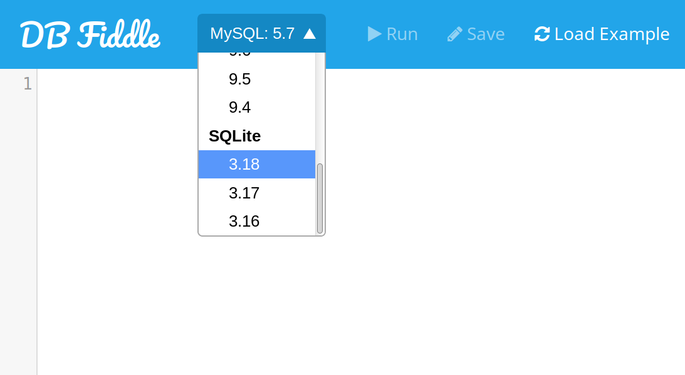

# WEEK 16 LESSON 1 : BASIC SQL

**What we will learn today?**

* Why we need databases.
* Creating a database with SQL, storing data in it.
* Retrieving data from a database using SQL.
* Inserting data into a database using SQL.
* Joins

# EXERCISE 1 : Breaking your code with nulls

Start by checking out https://github.com/CodeYourFuture/cyf-hotel (branch - master?)

Go to API end point for add reservation.

1. Take existing code that stores reservation as a JSON snippet with subkeys for customer and rooms.

2. Put in null for customer id and room id.

3. Try it out.

# EXERCISE 2 : What happened?

1. What happened from the perspective of the *code*?

2. What happened from the perspective of the *user*?

3. What *should* happen when you enter invalid data into your programs?

4. How should you make that happen?


# LESSON 1 : What is the point of a database?

The database is a way to store *valid* structured data in a way that *cannot easily be violated* and then retrieve it.

The way we use a database is completely different to the way we store things in files. In a file, you can put anything in and get it out. How you get it out is up to you. The program needs to open, close, retrieve, store or modify everything itself. All the responsibility for that belongs to the program.

A Database is stored using a Relational Database Management system (RDBMS) which enfores:

- Data constraints (e.g. each reservation *must* have a customer)
- Data types (e.g. check in date *can only* be a date)
- Uniqueness of certain pieces of data (e.g. there is *only one* person with the driver's license ID 941413).
- Organizing how the data is retrieved and assembled (e.g. fetch me all reservations under customer "Donald Trump").
- Executes on a different process/machine, meaning that the queries can be parallelized, and work can be offloaded from the main server.

We're going to teach you a new programming language. It's called SQL. Pronounced "S - Q - L" or sequel,
as in "the sequel to the original 3 stars films were awful."

The language is *just* used for two things:

* Telling a big store of data (the database) to store data
* Telling a big store of data (the database) to retrieve data

## Create a Database

Students, first open up your browsers and visit [DB Fiddle](https://www.db-fiddle.com/)
at www.db-fiddle.com.

Then, select SQLite:



So, on the left hand side here is where we write the code that *creates* the data.

On the right hand side is where we write the code that *retrieves* the data.

### LESSON: How to create a table

First thing we want to store is customers, since without customers,
you don't have a hotel.

Students. Type the following in:

What to put in the *left* hand side (data definition):

```sql
create table customers (
    title varchar,
    firstname varchar,
    surname varchar,
);

insert into customers (title, firstname, surname, email) values ('Mr', 'Donald', 'Trump',);
```

What to put on the *right* hand side (data retrieval):

```sql
select * from customers;
```

What we have here:

* Creating a table - this creates the *structure* which you can use to put data in. The items are *columns*.
* Insert into - puts data *into* that structure.
* Select * from - gets the entire contents of that table.

* 'title varchar' - this means we're creating a column with the name 'title' which holds a 'variable number of characters'. This is pretty much the same thing as a string in javascript.

## EXERCISE: Create tables and insert data

1. Add yourselves as *second* customers to Donald Trump.
2. Collect email addresses from yourself and Donald (donald.trump@whitehouse.gov) and have them displayed on screen.
3. Add me - "Colm O'Conner" - as your third customer. My email address iss "colm.oconner.github@gmail.com".

## LESSON : Data types

```sql
create table invoices (
    reservation_id      integer,
    total               number,
    invoice_date_time   datetime not null,
    paid                boolean default false
);

insert into invoices (reservation_id, total, invoice_date_time, paid) values (123, 3444.50, '01/01/2017', 1);

insert into invoices (reservation_id, total, invoice_date_time) values (124, 3445.50, '02/01/2017');
```

```sql
select * from invoices
```

* What we have here is an 'integer', a 'number', a 'datetime' and a boolean. These are all analogous to data types
which you have learned about in javascript.

* For "paid" which is either yes or no - we have a default of 'no', so you can insert data without it and it will just assume you mean 'no'.

* For 'invoice_date_time' we have a 'not null' constraint which means that you *have* to give a datetime and you can't give 'null' because it is meaningless to have a non-null datetime.

More reading : https://www.sqlite.org/datatype3.html

## EXERCISE : Data types

Create a reservations table with columns for customer ID, room ID, check in date, check out date and price per night. Bear in mind that customers *do* have to give a check in date, but they don't have to give a check out date.

## LESSON : Filtering

Currently we've just put data in to a table and gotten *all* of it out. What about if we only want *specific* data?

For this we will introduce something called 'WHERE'.

Lets go back to the invoices table:

```sql
create table invoices (
    reservation_id      integer,
    total               number,
    invoice_date_time   datetime not null,
    paid                boolean default false
);

insert into invoices (reservation_id, total, invoice_date_time, paid) values (123, 143.50, '01/01/2017', 1);

insert into invoices (reservation_id, total, invoice_date_time) values (124, 250.50, '02/01/2017');

insert into invoices (reservation_id, total, invoice_date_time) values (150, 431.50, '03/01/2017');

insert into invoices (reservation_id, total, invoice_date_time) values (155, 300.50, '04/01/2017', 1);

insert into invoices (reservation_id, total, invoice_date_time) values (156, 284.35, '04/01/2017', 1);
```

```sql
select * from invoices
```

```sql
select * from invoices where reservation_id = 123;
```

```sql
select * from invoices where invoice_date_time < '03/01/2017';
```

## EXERCISE : Filtering

Write SQL for the following:

1. Which invoices were paid?

2. Which invoices were for under 300 pounds?

3. Which invoices paid on 3rd January 2017 or after?

## LESSON : Primary Keys

Ok, now we're going to introduce a problem. We're going to pretend that a secretary did this.

```sql
create table invoices (
    reservation_id      integer,
    total               number,
    invoice_date_time   datetime not null,
    paid                boolean default false
);

insert into invoices (reservation_id, total, invoice_date_time, paid) values (123, 143.50, '01/01/2017');

insert into invoices (reservation_id, total, invoice_date_time) values (123, 250.50, '02/01/2017');
```

```sql
select * from invoices;
```

QUESTION FOR PERSON IN CLASS WHO LOOKS THE MOST CONFUSED : What is the problem here?

So, a business calls up and says that they need to pay invoice 123. What happens?

We solve this problem with something called a "primary key" - what this does is make it so the database will absolutely refuse to accept a number if you enter in a duplicate.

```sql
create table invoices (
    reservation_id      integer primary key,
    total               number,
    invoice_date_time   datetime not null,
    paid                boolean default false
);

insert into invoices (reservation_id, total, invoice_date_time, paid) values (123, 143.50, '01/01/2017');

insert into invoices (reservation_id, total, invoice_date_time) values (123, 250.50, '02/01/2017');
```

```sql
create table invoices (
    reservation_id      integer primary key,
    total               number,
    invoice_date_time   datetime not null,
    paid                boolean default false
);

insert into invoices (reservation_id, total, invoice_date_time, paid) values (123, 143.50, '01/01/2017', 1);

insert into invoices (reservation_id, total, invoice_date_time) values (124, 250.50, '02/01/2017');

insert into invoices (reservation_id, total, invoice_date_time) values (999, 250.50, '03/01/2017');
```

Quick fire question round for students who look most confused / not paying attention:

* Is first name a good candidate for a primary key?
* Is first name and surname together a good candidate for a primary key?
* Is a driver's license ID a good candidate for a primary key?
* Is a passport ID a good candidate for a primary key?
* Is just coming up with an arbitrary number that is unique a good candidate for a primary key?

Now, this is great, but we have another problem. When the hotel staff check the guest in they don't really want to think up a random number that hasn't been used before. Why not just let the database figure out what a good number to use is?

For this we use autoincrement:

```sql
create table invoices (
    reservation_id      integer primary key autoincrement,
    total               number,
    invoice_date_time   datetime not null,
    paid                boolean default false
);

insert into invoices (total, invoice_date_time, paid) values (143.50, '01/01/2017', 1);

insert into invoices (total, invoice_date_time) values (250.50, '02/01/2017');
```

Now, picking primary keys is a tricky problem. You need to make sure that you pick some kind of
identifier which you know can't be repeated. Usually arbitrary incrementing numbers are good,
but they're not always ideal.

## EXERCISE : Primary Keys

1. Recreate customer table with a primary key. Bear in mind that you don't have a driver's license or passport ID.

2. Recreate reservations table with a primary key.

## LESSON : Foreign keys


```sql

create table reservations (
  `id`                    integer primary key autoincrement,
  `customer_id`           integer,
  `room_id`               integer,
  `check_in_date`         datetime not null,
  `checkout_out_date`,    datetime,
  `room_price_per_night`  real,
);

create table invoices (
    id                  integer primary key autoincrement,
    reservation_id      integer,
    total               number,
    invoice_date_time   datetime not null,
    paid                boolean default false
);

insert into reservations (customer_id, room_id, check_in_date, check_out_date, room_price_per_night) values (123, 55, '01/01/2017', '02/01/2017', 100);

insert into reservations (customer_id, room_id, check_in_date, check_out_date, room_price_per_night) values (124, 55, '03/01/2017', '05/01/2017', 100);

insert into invoices (reservation_id, total, invoice_date_time, paid) values (123, 100, '03/01/2017', 1);

insert into invoices (reservation_id, total, invoice_date_time) values (124, 50, '06/01/2017', 0);

insert into invoices (reservation_id, total, invoice_date_time) values (124, 50, '06/01/2017', 1);
```

Point out that the reservation ID corresponds with the ID on the reservations table.

```sql
insert into invoices (reservation_id, total, invoice_date_time) values (125, 50, '06/01/2017);
```

Question for class: what is the problem?

A: Invoice isn't going to get paid because we don't know who it's for.

To fix this problem we place an additional restriction on the data - you can only add IDs that exist.


```sql

create table reservations (
  `id`                    integer primary key autoincrement,
  `customer_id`           integer,
  `room_id`               integer,
  `check_in_date`         datetime not null,
  `checkout_out_date`,    datetime,
  `room_price_per_night`  real,
);

create table invoices (
    id                           integer primary key autoincrement,
    foreign key(reservation_id)  references reservations(reservation_id),
    total                        number,
    invoice_date_time            datetime not null,
    paid                         boolean default false
);

```

## EXERCISE : Foreign keys

Add foreign key relationship for 

## LESSON : Updating data

Fix misspelled name of teacher OConner.

## EXERCISE : Updating data

## LESSON : Joins

## EXERCISE : Joins

TODO : 
--------
* Create table creates 

Exercises:
- CREATE TABLE Rooms
- CREATE TABLE Customers

### How to insert into a table
```
INSERT INTO Customer
```

Exercises:
- INSERT INTO Room (with ID of 6)
- INSERT INTO Reservation

** Add a couple of customers, some of which with the same name/other columns
** Add Colm >> OConner << as one of the users

### How to extract data

Start with select from single table

```
SELECT * FROM Customer
```

Exercise:
- SELECT on Reservation
- SELECT on Room


#### Add the filtering

```
SELECT * FROM Customer WHERE something
```

Exercise:
- SELECT AND WHERE ROOM price > 50
- SELECT WHERE checkout date is between next thursday and sunday

*** Filter by name so that we can highlight the name ambiguity ***

*** Highlight the issue with multiple customers with the same name that cannot be distinguished properly when querying. ***


#### Deal with name ambiguity

- Remove existing table `DROP table`

Q: how could we deal with this issue?

A: Primary key to eliminate ambiguity

E.g. Passports and Driver's lisences have unique ids, because people can have same names and even be born on the same day.

We could in principle use one of these real unique identifiers, but they are not always available.

- Add autoincrementing ids to solve the problem and recreate table.
- Re-insert the same users


Q: What makes a good primary key?

A: passport, driver's lisence, auto generated identifiers

### Update data

We need to chane the data to fix misspelled name of Teacher. Colm. whose name is set originall in the databse to be be 'Oconner'

```
UPDATE Client set surname = 'O\'Connor' Client WHERE id = 1;
```


### Joining tables in SELECT


// DIAGRAM WHEN WE EXPLAIN IT

```
SELECT * from Reservation JOIN Customer - reservations associated with customers
```

Exercise:
- SELECT AND JOIN - reservations for a particular room
- SELECT AND JOIN - mix join AND where

As an exercise: SELECT AND JOIN - rooms associated with reservations


