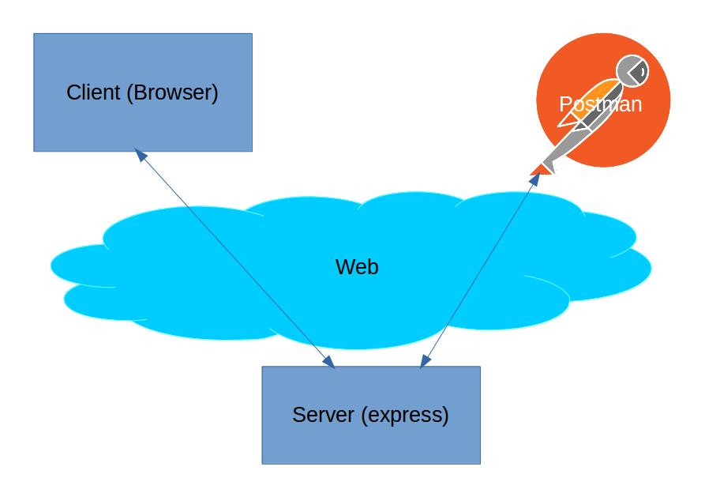

# Database 1: Introduction to SQL

**What will we learn today?**

* Introduction to database
  * Why do we need them?
  * Different types of database
  * Database modeling exercise 
  	 
* Introduction to PostgreSQL
  * What is SQL?
  * What is a RDBMS?
  * What characterises a relational database?
  * Check your PostgreSQL installation

* Communicating with the database using SQL
  * Creating a table
  * Inserting data
  * Retrieving data

## Introduction to database

A database is a structured set of data held in a computer. It provides ways to store, retrieve and organize information.

### Why do we need them?

In the past few weeks, you stored and retrieved data using files. This is fine for simple data but it can quickly become an issue as your application becomes more complex and needs to store and manipulate more complicated data. For example, imagine you want to develop the next biggest hotel booking application. You will need to store somewhere the list of hotels available for booking, and as you add more features, you will need to save users information, the reviews they post for each hotel, but also the bookings each user makes. You can see that the data you need to handle can become very complicated, especially when you need to consider that data are not static, as they can be updated or deleted. To work more effectively with data, we can then use a database, which present the following benefits:

- A database defines a structure for your data and the relationships between entities
- A database provides convenient and performant ways to safely store and retrieve data
- A database provides a mechanism to check the validity of your data

### Different types of database

There are many different kinds of database and different implementations. Sometimes, a database type is a better fit to certain use case or certain problems. The most well-known database types include relational database, key/value database, graph database and document database (also known as NoSQL). For this class, we will focus specifically on relational database as they are the most widely used and supported. You can consult [DB-Engines](https://db-engines.com/en/ranking) to see a ranking of the most used database, as you can see, there is a lot of them!

### Database modeling exercise

**Scenario:** You've been hired to create a database for a new company which wants to revolutionize the hotel booking market. The first task you've been given is to model how the company would store its data in a database. Here are your requirements:

- The company wants to store all the hotels available on their website
- For each hotel, the company wants to record the name, the number of rooms, the room types and the price for each room types. The price of each room type is fixed for each hotel.
- The company also needs to store the information of customers who registered on their website with an email and a password.
- Customers need to be able to record their bank details which consist of an account number and a sort code.
- Finally, as customers can book a room in an hotel on the website, the company wants to store all the bookings.

With mentors help, model the database for this company. In particular, show the different entities, fields and relationships between each entity.


## Introduction to PostgreSQL

*"PostgreSQL is a powerful, open source object-relational database system that uses and extends the SQL language combined with many features that safely store and scale the most complicated data workloads. The origins of PostgreSQL date back to 1986 as part of the POSTGRES project at the University of California at Berkeley and has more than 30 years of active development on the core platform."* (source: [postgresql.org](https://www.postgresql.org/about/))

### What is SQL?

- Pronounced S-Q-L or sequel
- Stands for Structured Query Language
- SQL is the standard language used to communicate with relational database
- SQL statements are used to query, create, update, delete records in a database
- SQL statements are executed by RDBMS.

### What is a RDBMS?

- Stands for Relational Database Management System
- It is a program that processes SQL statements to manage a relational database
- PostgreSQL is a RDBMS.

### What characterizes a relational database?

As mentioned previously, a relational database is a specific type of database. Data is stored in *tables* of *rows* and *columns* as per the example below:

<!--  -->
<p align="center">
  
</p>

**How about storing everything in one big table as shown below? Why isn't it a good idea?**

A customer could have several bookings. If the customer changes their telephone number, you would have to update every single rows for this customer with their new number, which is more prone to errors. As a general rule, try to avoid duplication of data, and instead design your system in a way that you have a single source of truth for each piece of data. The example below is **NOT** a good design.

<!--  -->
<p align="center">
  
</p>


### Check your PostgreSQL installation

Open a terminal in your laptop and verify the command `psql` returns the version of PostgreSQL. In psql, you can type use the command `help` to show the help menu. Within the command prompt, you can enter SQL statements and run them against PostgreSQL.


## Communicating with the database using SQL

### Creating a table

TODO

### Inserting data

TODO

### Retrieving data

TODO


## ========== OLD CLASS BELOW ============


## LESSON 1C: CREATING A TABLE

The first thing we want to store is customers, since without customers, you don't have a hotel.

First, open a file in any text editor and put the following in a file called 'hotel.sql':

```sql
PRAGMA foreign_keys = ON;

create table customers (
    title varchar,
    firstname varchar,
    surname varchar
);

insert into customers (title, firstname, surname) values ('Mr', 'Donald', 'Trump');
```

What we have here:

* PRAGMA statement is to set up some relevant settings that we don't need to worry about just yet.
* Creating a table - this creates the *structure* which you can use to put data in. The items are *columns*.
* Insert into - puts data *into* that structure.
* 'title varchar' - this means we're creating a column with the name 'title' which holds a 'variable number of characters'. This is pretty much the same thing as a string in javascript.

Now, in the command prompt run the following:

```
$ sqlite3 -init hotel.sql
```

Now that the file has been loaded with one table containing one row of data, you can read it back
out again like this:

```sql
select * from customers;
```

This should display:

```
sqlite> select * from customers;
Mr|Donald|Trump
```

**Note**: We are using a in memory database. This means that for each exercise we will be adding sql statements to our `hotel.sql` and then read this file into sqlite3 to create our database, because everytime we close `sqlite3` the database will be deleted and the data will be lost.


#### EXERCISE 1C: Create tables and insert data

1. Amend hotel.sql create the database again and add yourselves as *second* customer using INSERT - so you're now staying in a hotel with Donald Trump. Run `select * from customers;` and ensure that you see yourself both as guests.

2. Change hotel.sql again to store email addresses from yourself and Donald (donald.trump@whitehouse.gov) and have them displayed on screen. Select everythin agian, and ensure you are both guests.

3. Change hotel.sql again. Add teacher - "Colm OConner" - as your third customer. My email address is "colm.oconner.github@gmail.com".

## LESSON 1D: Data types and directives

```sql
create table invoices (
    id                  integer,
    total               number,
    invoice_date_time   datetime not null,
    paid                boolean default 0
);

insert into invoices (id, total, invoice_date_time, paid) values (123, 3444.50, '2017-01-01', 1);

insert into invoices (id, total, invoice_date_time) values (124, 3445.50, '2017-01-02');
```

And in the command box:

```sql
select * from invoices;
```

What we have here:

* An 'integer', a 'number', a 'datetime' and a 'boolean'. These are all analogous to data types which you have learned about in javascript.

* For "paid" which is either yes (`1`) or no (`0`) - we have a default of no (`0`)- it's saying that if you insert data and don't specify 'paid' as a column when you INSERT data, it will assume you meant 'no'.

* For 'invoice_date_time' you must store the data in the form of a combination of date and time. It has a 'not null' constraint which means that you *have* to give a datetime when you insert data, it will refuse to let you insert an invoice without specifying invoice_date_time and refuse to let you explicitly give your invoice_date_time as null.

**Note:** For the sake of simplicity we will be using the `YYYY-MM-DD` date format.

Further reading on sqlite3 types  [here](https://www.sqlite.org/datatype3.html).


#### EXERCISE 1D : Data types and directives

In your "hotel.sql" create a reservations table with columns for customer ID, room ID, check in date, check out date and price per night and insert a bunch of example data - maybe you and 10 friends or celebrities.

The hotel manager has told you:

- Customers *do* have to give a check in date, but they don't have to give a check out date.
- Reservations need a customer ID and a room ID
- Reservations have a check in date, a check out date and a price per night.

## LESSON 1E : SELECT

Currently we've just put data in to a table and gotten *all* of it out. What about if we only want *specific* data?

For this we will introduce a SQL key word called 'WHERE'.

Lets go back to the invoices table and add a bunch of data.
Replace the previous insert statements for invoices with the following ones:

```sql
insert into invoices (id, total, invoice_date_time, paid) values (123, 143.50, '2017-01-01', 1);

insert into invoices (id, total, invoice_date_time) values (124, 250.50, '2017-01-02');

insert into invoices (id, total, invoice_date_time) values (150, 431.50, '2017-01-03');

insert into invoices (id, total, invoice_date_time, paid) values (155, 300.50, '2017-01-04', 1);

insert into invoices (id, total, invoice_date_time, paid) values (156, 284.35, '2017-01-04', 1);
```

So, if you do a regular query you just get all of the data:

```sql
select * from invoices;
```

But you can filter the data through logical expressions like:

```sql
select * from invoices where id = 123;
```

or:
```sql
select * from invoices where invoice_date_time < '2017-01-03';
```

#### EXERCISE 1F : SELECT

Write SQL for the following:

1. Which invoices were paid?

2. Which invoices were for under 300 pounds?

3. Which invoices paid on 3rd January 2017 or after?


## LESSON 1G : Primary Keys

Ok, now we're going to introduce a problem. Let's say a secretary types in a bunch of invoice IDs and values:

```sql
insert into invoices (id, total, invoice_date_time, paid) values (323, 143.50, '2017-01-01', 1);

insert into invoices (id, total, invoice_date_time) values (323, 250.50, '2017-01-02');
```

QUESTION FOR CLASS : What is the problem here? [ A business calls up and says they need to pay invoice 323 ]

We solve this problem with something called a "primary key" - what this does is make it so the database will refuse to accept a value that is already in the database, it will not accept duplicates. We can define a primary key for the `id` adding `primary key` after the type for `id` as follows:

```sql
create table invoices (
    id                  integer primary key,
    total               number,
    invoice_date_time   datetime not null,
    paid                boolean default 0
);

insert into invoices (id, total, invoice_date_time, paid) values (323, 143.50, '2017-01-01', 1);
```

Update your hotel.sql file to have the invoices table defined as above.

Try entering an invoice with ID 323 now, what do you get?

```sql
sqlite> insert into invoices (id, total, invoice_date_time) values (323, 250.50, '2017-01-02');
Error: UNIQUE constraint failed: invoices.id
```

Now, picking primary keys is a tricky problem. You need to make sure that you pick some kind of identifier which you know will always be *unique*.


QUESTIONS FOR CLASS:

* Is first name a good candidate for a primary key?
* Is first name and surname together a good candidate for a primary key?
* Is a driver's license ID a good candidate for a primary key? [ if and only if everybody is from the same country ]
* Is a passport ID a good candidate for a primary key? [ if and only if everybody is from europe ]
* Is just coming up with an arbitrary number that is unique a good candidate for a primary key?

## LESSON 1H: AUTOINCREMENTING PRIMARY KEYS

We still have a problem here. Joe the office manager who is entering invoices doesn't really want to keep coming up with random numbers every time he enters an invoice. Why not just get the database to give us an ID?

We can do that with a magic feature called autoincrementing numbers. You don't specify the ID and the database will just give your row a new ID. What ID will it give it? The ID of the last row plus one.

```sql
create table invoices (
    id                  integer primary key autoincrement,
    total               number,
    invoice_date_time   datetime not null,
    paid                boolean default 0
);

insert into invoices (total, invoice_date_time, paid) values (143.50, '2017-01-01', 1);

insert into invoices (total, invoice_date_time) values (250.50, '2017-01-02');
```

#### EXERCISE 1H : PRIMARY KEYS

1. Update yout hotel.sql file to account for the auto increment ids on the `invoices` table. Meaning, remove the id from the insert, because they should be automatically added now.

2. Recreate customer table with a primary key. Bear in mind that you don't have a driver's license or passport ID. Update all the insert statements for `customers` to not specify the id.


## LESSON 1I : FOREIGN KEYS

Now, as we've seen two tables that have an intrinsic relationship to one another. Every invoice has a reservation ID.


```sql
create table invoices (
    `id`                  integer primary key autoincrement,
    `reservation_id`      integer,
    `total`               number,
    `invoice_date_time`   datetime not null,
    `paid`                boolean default 0,
);

create table reservations (
    `id`                    integer primary key,
    `customer_id`           integer,
    `room_id`               integer,
    `check_in_date`         datetime not null,
    `check_out_date`,       datetime,
    `room_price_per_night`  real,
);

insert into reservations (customer_id, room_id, check_in_date, check_out_date, room_price_per_night) values (123, 55, '2017-01-01', '2017-01-02', 100);

insert into reservations (customer_id, room_id, check_in_date, check_out_date, room_price_per_night) values (124, 55, '2017-01-03', '2017-01-05', 100);

insert into invoices (reservation_id, total, invoice_date_time, paid) values (123, 100, '2017-01-03', 1);

insert into invoices (reservation_id, total, invoice_date_time, paid) values (124, 50, '2017-01-06', 0);

insert into invoices (reservation_id, total, invoice_date_time) values (124, 50, '2017-01-06');
```

Point out that the reservation ID corresponds with the ID on the reservations table.

```sql
insert into invoices (reservation_id, total, invoice_date_time) values (125, 50, '2017-01-06');
```

QUESTION FOR CLASS: What's the problem with the last statement?

A: Invoice isn't going to get paid because we don't know who it's for.

To fix this problem we place an additional restriction on the data
- you can only add IDs that *exist* to columns referencing other tables
- and you really need to specify the `reservation_id` when you are inserting on the invoices.


```sql

create table reservations (
    `id`                    integer primary key,
    `customer_id`           integer,
    `room_id`               integer,
    `check_in_date`         datetime not null,
    `check_out_date`,       datetime,
    `room_price_per_night`  real,
);

create table invoices (
    `id`                            integer primary key autoincrement,
    `reservation_id`                integer not null,
    `total`                         number,
    `invoice_date_time`             datetime not null,
    `paid`                          boolean default 0,
    foreign key(reservation_id)     references reservations(id),
);

```

Now, if you try to add invoices without a `reservation_id` that really references a reservation entry on the reservations table you'll get this:

```sql
insert into invoices (reservation_id, total, invoice_date_time) values (125, 50, '2017-01-06');

Error: FOREIGN KEY constraint failed
```

Or, if you try to add an invoice without specifying the `reservation_id` at all:

```sql
insert into invoices (total, invoice_date_time) values (50, '2017-01-06');
Error: NOT NULL constraint failed:
```

Note that:

- 'foreign key(reservation_id)' means that we're putting a foreign key relationship on the *reservation_id* column.
- 'references reservations(id)' means that it's referring to the 'id' column in the reservations table.
- reservation_id is a column on invoices. It is a number, like 3 - referring to the 'id' of a row in reservations.
- reservation_id can *not* be null because it must *always* reference an existing row.

Remember:

- If you removed "foreign key(reservation_id) references reservations(id)" it will let you insert invalid data without giving you an error - you won't be able to create an invoice with a reservation_id of 9435454 without a corresponding reservation with id 9435454 in the reservations table.

- We WANT errors like this, which is why we put the foreign key there.

#### EXERCISE 1I : Foreign keys

1. Change the `hotel.sql` file to respect the `foreign keys` and `not null` constraints on the invoice insert statements.

2. Change the file to add foreign key relationship for reservations table and customers table; update the insert statements accordingly; and add more data for those tables.


## LESSON 1J : Updating data

Let's say that we made a mistake with one of the invoices created above.

First get the ID of an invoice entered earlier:

```sql
select * from invoices where invoice_date_time = '2017-01-01';
```

If you want to change this invoice to be £300, you need to use 'UPDATE'.

```sql
update invoices set room_price_per_night = 300.0 where id = <I-FROM-ABOVE>;
```

#### EXERCISE 1J : Updating data

1. Run SQL from lesson 1C where my surname was entered as OConner. My name is actually O'Connor. Fix it using 'UPDATE'.

# HOMEWORK


### Homework part 1: Setting up the environment for next class

You have already worked with back end servers using Express. This is just another yet another one that we will be connecting to a database.

In order for us to interact with the server, we are going to use [Postman](https://www.getpostman.com/), which will accurately mimic API calls made from react. In the last three lessons you're going to make react do to this back end what postman is going to do today.


**Task** Fork and then clone the [repo](https://github.com/CodeYourFuture/cyf-hotel-db), and follow the instructions to set up and environment.

**Task** Install chrome extention for [Postman](https://chrome.google.com/webstore/detail/tabbed-postman-rest-clien/coohjcphdfgbiolnekdpbcijmhambjff?hl=en-GB).

<!--  -->
<p align="center">
  
</p>


<!--  -->
<p align="center">
  
</p>

Run "npm start" and use postman to GET from `http://localhost:8080/api/customers` and email a screenshot
to ams.pedro@gmail.com and crdoconnor@gmail.com.

If you have any issues (and you might), please contact one of us or the mentors for help.

### Homework part 2: Add tables and data to the hotel database

Using what you have learned in today's lesson, extend database/schema.sql in the cyf-hotel-db repo you
just set up.

It currently contains a customers table with one customer in it:

    CREATE TABLE IF NOT EXISTS customers (
      ID INTEGER PRIMARY KEY AUTOINCREMENT,
      title TEXT(16),
      first_name TEXT(64) NOT NULL,
      surname TEXT (64) NOT NULL,
      email TEXT (64)
    );


    INSERT INTO customers (
      title, first_name, surname, email
    ) VALUES (
      'Mr',
      'John',
      'Dove',
      'john.doe@domain.com'
    );


Extend it so that it has a structure like so (each line is a foreign key):

<!--  -->
<p align="center">
  
</p>

As well as creating the database tables that create that structure, add insert statements for
5-10 rows of example data for each table as well.

Email your amended schema.sql to to ams.pedro@gmail.com and crdoconnor@gmail.com.
