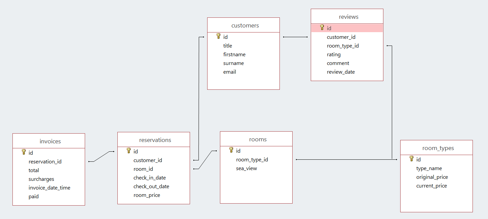
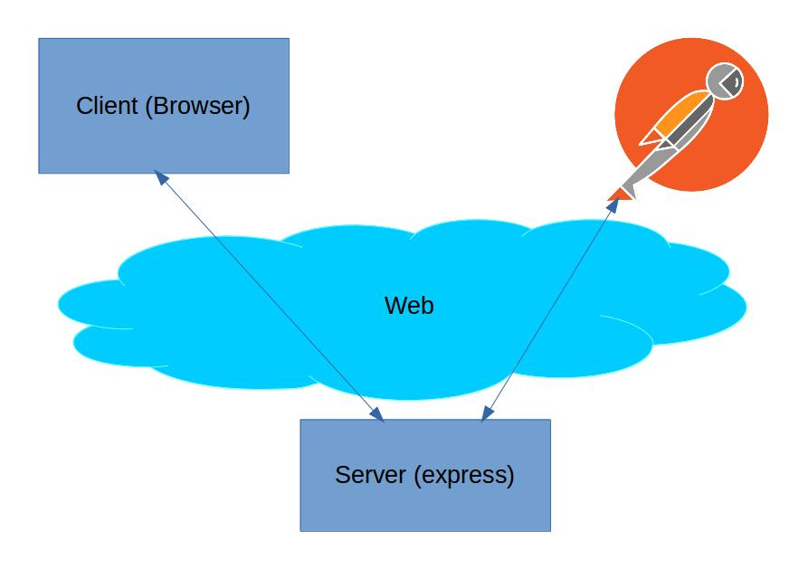
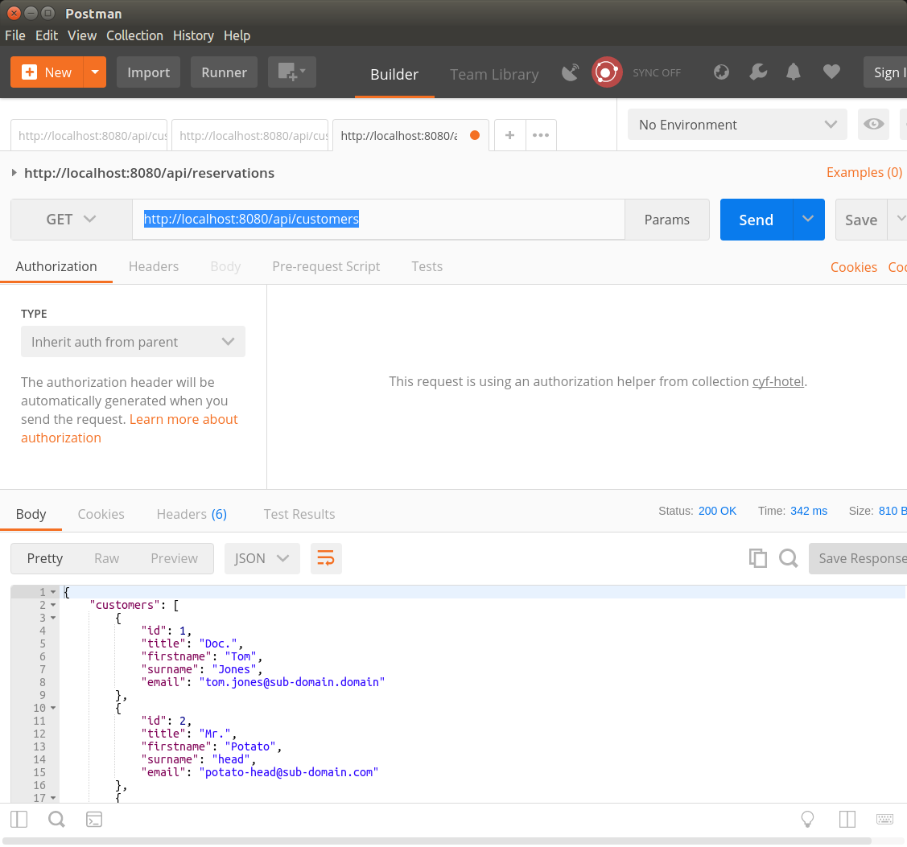
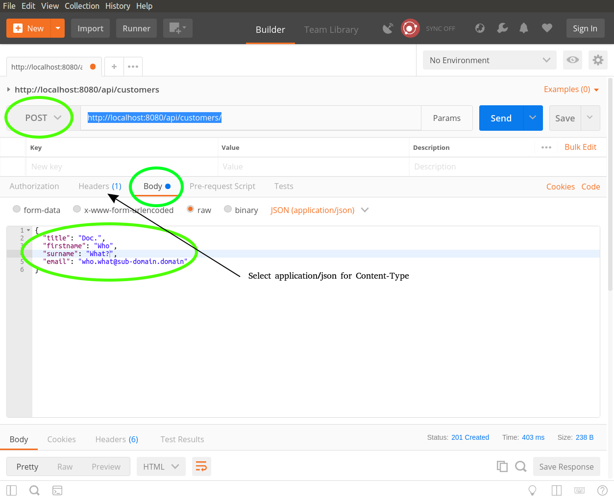
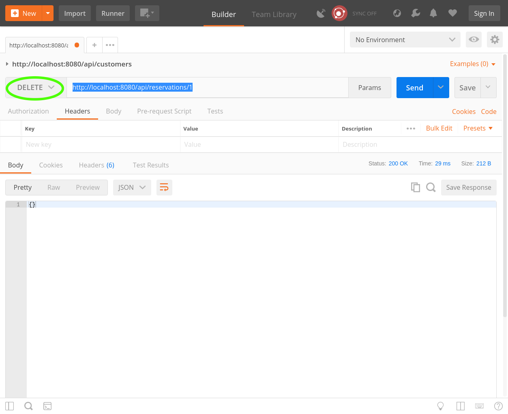

# LESSON 2: LINKING JAVASCRIPT AND SQL

**Review of last lesson**

What we did last lesson:

* Why we need databases
* Installing SQLite
* Creating a database with SQL and storing data in it.
* Inserting data into a database using SQL.
* Retrieving data from a database using SQL.
* Escaping (who figured out how to insert my real name into the database?)

Homework from last lesson:



- Did you do update?
- Did everybody finish hotel.sql so that it looks like the above diagram?
- About those foreign key constraints that weren't being enforced on SQLite -- enforce PRAGMA and version
- Did we understand foreign keys?
- Does everybody have enough data in their database? Between 5 and 10 rows per table.

**What we will learn today?**

- Why NoSQL why SQL?
- Checking out a project and adding hotel.sql to the repo
- How to run SQLite *with node* on your machine - setting up a development environment.
- How to run a database query that retrieves tabular data in node express to an endpoint.
- Inserting data from an endpoint.
- Updating data from an endpoint.
- Dealing with unclear user stories. There is a TRAP in one of these user stories we will be giving you today.
- What is the difference between user story, use case and user acceptance test.

### SHOULD I USE SQL OR SHOULD I USE NOSQL?
**TODO** Maybe move to class1?

Short answer: if in doubt, you should just use SQL. Always.

Long answer: There are two forms of NoSQL.

1) Extremely high scale -- Cassandra --- constraints are not enforced due to high load and high levels of data.

2) For beginner programmers - Mongo --- constraints (among other features) are not there to simplify things for beginners.


This lesson will primarily be about taking what you have stored in a *flat file*, and changing it such that it is stored in a database instead. This will be done to appease Marriott hotel manager grumpy cat. With all the constraints you have already added to the database, on your `hotel.sql` file, the application should be much safer now - if you screw up (and you will, because bugs are as inevitable as taxes), you can *see* the bugs getting deployed before they start affecting guests.

Use `/server/class2.js` for the exercises of this class.


### Setting up the environment

**Task** Clone the [repo](https://github.com/CodeYourFuture/cyf-hotel-db/tree/class2), and follow the instructions to set the environment up.

You have already worked with back end servers using Express. This is just another yet another one, that we will be connecting to a database.

In order for us to interact with the server, we are going to use [Postman](https://www.getpostman.com/), which will accurately mimic API calls made from react. In the last three lessons you're going to make react do to this back end what postman is going to do today.




We're going to use this set up for debugging and testing our back-end. Can anybody tell me what debugging is?


**Task** Download and install [Postman](https://www.getpostman.com/).

Now let us all try Postman by GETting from `http://localhost:8080/api/customers`, as is shown next.



##### Installing Postman
**Ubuntu guide** [here](https://blog.bluematador.com/posts/postman-how-to-install-on-ubuntu-1604/).

**For Windows and mac** should be just install and run.

**TODO** Maybe replace this with [chrome extension](https://chrome.google.com/webstore/detail/tabbed-postman-rest-clien/coohjcphdfgbiolnekdpbcijmhambjff?hl=en-GB) which seems to be much simpler.


### LESSON 1: SELECT ALL THE THINGS!

**User Story:** As a staff member, I want to be able to view a list of customers so that I can see who has visited our hotel.

**Use case** When a user does a GET request to /customers it should return customer titles, first names, surnames.

**User acceptance test**: Do a GET request and get back [{"title": "mr", "firstname": "Donald", "surname": "Trump"}, {"title": "Mrs", "firstname": "Hillary", "surname": "Clinton"}]

Remove the code that is returning a JSON object on end point `/customers`, and use what you have learned about to SQL to fill in the query that fetches all the customers from the database.

- select everything

```javascript
router.get('/customers', function(req, res) {
  res.status(200).json({
    customers: [{
      id: 2,
      title: 'Mr',
      firstname: 'Laurie',
      surname: 'Ainley',
      email: 'laurie@ainley.com'
    }
  ]});
})
```

Who can tell me what this is currently doing? What do we need to make it do?

So, the answer is here:

```javascript
router.get('/customers', function(req, res) {
  res.status(200).json({
    db.all(sql, [], (err, 'select * from customers' ) => {
      res.status(200).json({
        customers: rows
      });
    });
  });
});
```

### Exercise 1

**User Story:** As a staff member I need to check the details of a given customer given its id.

**User Acceptance test**: Complete the end-point `/customers/:id`, so that it extracts that customer information from the database, and replies back with that information as JSON.

- select and filter by id
- hint: simple select and filter by ID

STRETCH GOAL (OPTIONAL) : If you get a request of /customers/notanumber (anything that isn't a number) it should return an HTTP 400 bad request.


### LESSON 2 : LIKE, WHATEVER

So, now we're going to deal with one of the most common issues with hotel databases: the guest's name being misspelled.

So, "Hilary Clinten" is added to the database. She calls up on the phone asking about her reservation and spells her name correctly on the phone. The hotel staff knows what *some of her name* sounds like but not all of it and they want to find her as a customer on the system.

For this problem where we want to search in *part* of a string we use the LIKE command:

```sql
select * from customers where surname like '%lint%';
```

It will search the `surname` string on each row for the substring `lint`, and return true for the ones where it is part of the string. The substring is matched insensitively with the actual data - meaning that it makes no difference if the stored value is upper case and the provided substring is lower case.
The `%` sign before and after `lint` indicates that we could have any character, and any number of characters before and after that substring.


### EXERCISE 2A

**User Story:** As a staff member I want to search for a customer through its `surname`, but we don't know that it might be misspelled.

**User Acceptance test**: Complete the end-point `/customers/:surname`, so that it extracts that customer information from the database, and replies back with that information as JSON.

- select and filter through like

### EXERCISE 3

**User Story:** As a guest, I want to register my details in the system so that I can check availability for my stay.

**User Acceptance test**: Take the data being POSTed to the `/customers` endpoint check it is inserted into the database.

STRETCH GOAL (OPTIONAL): If a bad request is made to customers - first name is missing, for instance, return an HTTP 400 Bad reqest.


### HOMEWORK 4
**Notes on Postman**

In the next image you can see Postman doing a POST request. Highlighed areas indicate the fields that need to be changed and/or information that needs to be added. The arrow points to a tab where you will need to set the type of content of this request. As denoted by the arrow legend, you will need to set `Content-Type` to `application/json`.


**User Story:** As a guest, I noticed that there is a typo on my details and wish to correct it.

**Use Case**: I go to '/customers/:id' endpoint and send updated data for each customer parameter: title, firstname, surname.

**User acceptance test**: PUT title=mr, firstname=donald, surname=trump on /customers/:id and check that the database was updated.


- update table
- remember your previous lesson
- hint: in the javascript code, instead of db.all() you will need ... what?


### HOMEWORK 4 : STRETCH GOAL (OPTIONAL)

The end point should properly detect which customer properties are being updated, and generate the appropriate SQL update statement.


### HOMEWORK 5

**User Story:** As a staff member, I want to create a new reservation.

Create and end-point to post a new reservation to `/reservations/`.

- insert into
- create the endpoint from scratch
- which HTTP method should you use?

STRETCH GOAL (OPTIONAL) : Return {"status": "error": "reason": "reason..."} if *anything* was wrong with the request.


### LESSON 6 : I WISH I COULD DELETE HIM IN REAL LIFE

We've currently done inserting data and updating data, but sometimes inserting data was just a mistake
and it needs to go.

It's a fairly simple command that looks like select, you just specify the table and a predicate and it wipes:

```sql
delete from customers where surname like '%trump%';
```

There are several things you need to worry about when you delete data and what you do about them will depend entirely upon what it is you are trying to do:

- What happens to the data that depends upon the data you deleted?
-- What if Trump had a reservation? Either a) delete the reservation as well? or b) raise an error and force the user to delete the data manually if they really want him gone.

- What if you want to undo the deletion?

- What if you want to mark some data as deleted but you might still want to refer to it?

- Often it's a good idea to give data the 'status' deleted instead of actually deleting it.

### HOMEWORK 6
**User Story:** As a staff member, I want to delete a canceled reservation from the database.


**Notes on Postman**
The delete request is actually pretty straight forward. We only need to select the type and provide the url:


Create an end-point to delete a given reservation from `/reservation/:id/`.

- delete


### HOMEWORK 7
**User Story:** As a staff member, I want to get a list of all the existing reservations.

Create an end-point to get from `/reservations` all existing reservations.

- create the endpoint from scratch


### HOMEWORK 8
**User Story:** As a customer, I want to check the details of a reservation.

Create and end-point to get from `/reservations/:id` the details of a resrevation through its `id`.

- simple filtering
- create the enpoint from scratch


### HOMEWORK 9
**User Story:** As a staff member, I want to get a list of all the reservations that start at a given date.

Create and end-point to get from `/reservations/starting-on/:startDate` all the reservations that start at a given date.

- simple filtering
- create the enpoint from scratch


### HOMEWORK 10
**User Story:** As a staff member, i want to get a list of all the reservations that are active at a given date.

Create and end-point to get from `/reservations/active-on/:date` all the reservations that are active on a given date - some customer has a room reserved on that day.

- multiple filtering.
- create the enpoint from scratch
