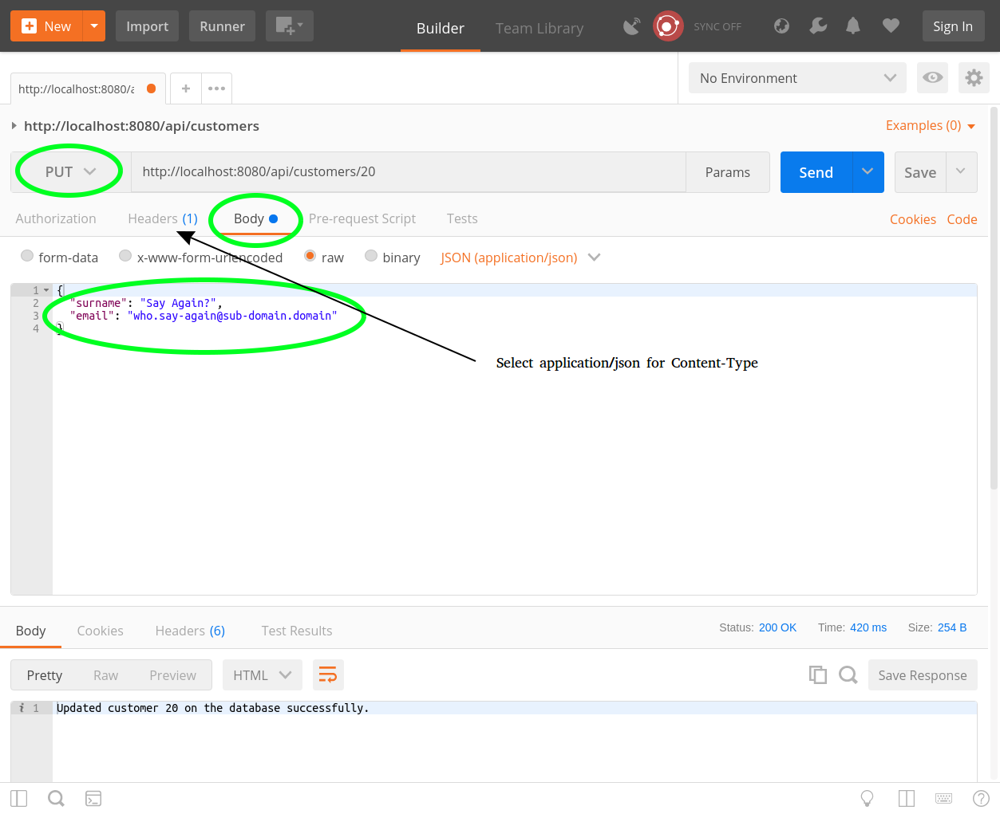

# LESSON 2: LINKING JAVASCRIPT AND SQL

**Review of last lesson**

What we did last lesson:

* Why we need databases
* Why NoSQL why SQL?
* Installing SQLite
* Creating a database with SQL and storing data in it.
* Inserting data into a database using SQL.
* Retrieving data from a database using SQL.
* Primary keys
* Escaping (dealing with awkward people with the surname O'Connor)
* How to run SQLite *with node* on your machine - setting up a development environment.

Homework from last lesson:


- Did everybody finish hotel.sql so that it looks like the above diagram?
- Did we understand foreign keys?
- Does everybody have enough data in their database? Between 5 and 10 rows per table.

**What we will learn today?**

- How to run a database query that retrieves tabular data in node express and returns it to an endpoint.
- Inserting data into a database from an endpoint.
- Updating data in a database from an endpoint.
- Dealing with unclear user stories. There is a trap in one of these user stories we will be giving you today.
- What is the difference between user story, use case and user acceptance test.


This lesson will primarily be about taking what you have stored in a *flat file*, and changing it such that it is stored in a database instead. This will be done to appease Big chain hotel manager grumpy cat - e.g. so that all invoices come attached to reservations. With all the constraints you have already added to the database, on your `hotel.sql` file, the application should be much safer now - if you screw up (and you will, because bugs are as inevitable as taxes), you can *see* the bugs getting deployed before they start screwing up your valuable data.

Use `/server/class2.js` for the exercises of this class.


### LESSON 1: SELECT ALL THE THINGS!

**User Story:** As a staff member, I want to be able to view a list of customers so that I can see who has visited our hotel.

**Use case** When a user does a GET request to /customers it should return customer titles, first names, surnames.

**User acceptance test**: Do a GET request and get back [{"title": "mr", "firstname": "Donald", "surname": "Trump"}, {"title": "Mrs", "firstname": "Hillary", "surname": "Clinton"}]

1) Grab the cyf-hotel-db.

2) Change the branch to class2.

3) Run "npm i" and then "npm start".

4) Use your browser to look at http://localhost:8080/api/customers/.

You should get back:

```javascript
{"customers":[{"ID":1,"title":"Mr","first_name":"Laurie","surname":"Ainley","email":"laurie@ainley.com"}]}
```

Remove the code that is returning a JSON object on end point `/customers`, and use what you have learned about to SQL to fill in the query that fetches all the customers from the database.

- select everything

```javascript
router.get('/customers', function(req, res) {
  res.status(200).json({
    customers: [{
      id: 2,
      title: 'Mr',
      firstname: 'Laurie',
      surname: 'Ainley',
      email: 'laurie@ainley.com'
    }
  ]});
})
```

Who can tell me what this is currently doing? What do we need to make it do?

So, the answer is here:

```javascript
router.get('/customers', function(req, res) {
 var sql = 'select * from customers';

 db.all(sql, [], (err, rows) => {
   if (err) {
       console.log('ERROR fetching from the database:', err);
       return;
   }
   console.log('Request succeeded, new data fetched', rows);
   res.status(200).json({
     customers: rows
   });
 });
});
```

### EXERCISE 1

**User Story:** As a staff member I need to check the details of a given customer given its id.

**User Acceptance test**: Complete the end-point `/customers/:id`, so that it extracts that customer information from the database, and replies back with that information as JSON.

- select and filter by id
- hint: simple select and filter by ID

OPTIONAL STRETCH GOAL : If you get a request of /customers/notanumber (anything that isn't a number) it should return an HTTP 400 bad request.


### LESSON 2 : LIKE, WHATEVER

We're going to deal with one of the most common issues with hotel databases: the guest's name being misspelled.

So, "Hilary Clinten" is added to the database by booking agent #1. She calls up on the phone asking about her reservation and booking agent #2 spells her name correctly on the phone. The hotel staff knows what *some of her name* sounds like but not all of it and they want to find her as a customer on the system.

For this problem where we want to search for rows where a column matches *part* of a string we use the LIKE command:

```sql
select * from customers where surname like '%lint%';
```

It will search the `surname` string on each row for the substring `lint`, and return true for the ones where it is part of the string. The substring is matched *case insensitively* with the actual data - meaning that it makes no difference if the stored value is upper case and the provided substring is lower case.

The `%` sign before and after `lint` indicates that we could have any character, and any number of characters before and after that substring.


### EXERCISE 2

**User Story:** As a staff member I want to search for a customer through their `surname`, but we don't know that it might be misspelled.

**User Acceptance test**: Complete the end-point `/customers/:surname`, so that it extracts that customer information from the database, and replies back with that information as JSON.

- select and filter through like

### EXERCISE 3

For this exercise, we will need to use postman to do an HTTP POST and send some JSON:

* Can somebody tell me what an HTTP POST is? How is it different from an HTTP GET?

* Can somebody tell me what JSON is?

<p align="center">
  
</p>

To do this, we must:

* Click on "headers" you will need to add the header `Content-Type` to `application/json` - this is telling the server that we're going to send some JSON.

* You will also need to click the drop down and change GET to POST - we are no longer GETting data we are POSTing data.


**User Story:** As a guest, I want to register my details in the system so that I can check availability for my stay.

**User Acceptance test**: Take this data being POSTed to the `/customers` endpoint check it is inserted into the database:

  {
    title: 'Mr',
    firstname: 'Laurie',
    surname: 'Ainley',
    email: 'laurie@ainley.com'
  }

STRETCH GOAL (OPTIONAL): If a bad request is made to customers - first name is missing, for instance, return an HTTP 400 Bad reqest.


### EXERCISE 4

**Notes on Postman**

In this case we sant Postman to do a PUT request. Again, highlighed areas indicate the fields that need to be changed and/or information that needs to be added. The arrow points to a tab where you will need to set the type of content of this request. As denoted by the arrow legend, you will need to set `Content-Type` to `application/json`.



**User Story:** As a guest, I noticed that there is a typo on my details and wish to correct it.

**Use Case**: I go to '/customers/:id' endpoint and send updated data for each customer parameter: title, firstname, surname.

**User acceptance test**: PUT title=mr, firstname=donald, surname=trump on /customers/:id and check that the database was updated.

- update table
- remember your previous lesson
- hint: in the javascript code, instead of db.all() you will need ... what?


### LESSON 3: IN IT

Now let's say that you want to see all of the customers who have the surname O'Connor or Trump.

The way we've learned so far (note the quotation marks):

```sql
select * from customers where surname = "O'Connor" or surname = 'Trump'
```

You can also do it like so:

```sql
select * from customers where surname in ("O'Connor", 'Trump')
```

This is might seem like a minor difference but:

- It is useful when you want your code to pass a list of things to the database and get a query which matches one or more of them.

- You can put *a whole select statement* in there if it returns one column. Your homework will require this.


##### EXERCISE 3.a

Write a query to get all of the customers with the first name "Colm" or "Hillary" using *IN*.


##### EXERCISE 3.b: OPTIONAL STRETCH GOAL

We're trying to locate a reservation for a customer. We know that:

- Their checkin date may have been June 1st, 2017 OR July 1st 2017
- Their checkout date may have been June 30th, 2017 OR July 30th 2017

Write a query using *IN* that is guaranteed to return their reservation.


### LESSON 4 : I WISH I COULD DELETE HIM IN REAL LIFE

We've currently done inserting data and updating data, but sometimes inserting data was just a mistake
and it needs to go.

It's a fairly simple command that looks like select, you just specify the table and a predicate and it wipes:

```sql
delete from customers where surname like '%trump%';
```

There are several things you need to worry about when you delete data and what you do about them will depend entirely upon what it is you are trying to do:

- What happens to the data that depends upon the data you deleted?
-- What if Trump had a reservation? Either a) delete the reservation as well? or b) raise an error and force the user to delete the data manually if they really want him gone.

- What if you want to undo the deletion?

- What if you want to mark some data as deleted but you might still want to refer to it?

- Often it's a good idea to give data the 'status' deleted instead of actually deleting it.

### Exercise 4.a
**User Story:** As a staff member, I want to delete a canceled reservation from the database.

**Notes on Postman**
The delete request is actually pretty straight forward. We only need to select the type and provide the url:


Create an end-point to delete a given reservation from `/reservation/:id/`.


## Homework

### HOMEWORK 1

The end point should properly detect which customer properties are being updated, and generate the appropriate SQL update statement.


### HOMEWORK 2

**User Story:** As a staff member, I want to create a new reservation.

Create and end-point to post a new reservation to `/reservations/`.

- insert into
- create the endpoint from scratch
- which HTTP method should you use?

STRETCH GOAL (OPTIONAL) : Return {"status": "error": "reason": "reason..."} if *anything* was wrong with the request.


### HOMEWORK 3
**User Story:** As a staff member, I want to get a list of all the existing reservations.

Create an end-point to get from `/reservations` all existing reservations.

- create the endpoint from scratch


### HOMEWORK 4
**User Story:** As a customer, I want to check the details of a reservation.

Create and end-point to get from `/reservations/:id` the details of a resrevation through its `id`.

- simple filtering
- create the enpoint from scratch


### HOMEWORK 5
**User Story:** As a staff member, I want to get a list of all the reservations that start at a given date.

Create and end-point to get from `/reservations/starting-on/:startDate` all the reservations that start at a given date.

- simple filtering
- create the enpoint from scratch


### HOMEWORK 6
**User Story:** As a staff member, i want to get a list of all the reservations that are active at a given date.

Create and end-point to get from `/reservations/active-on/:date` all the reservations that are active on a given date - some customer has a room reserved on that day.

- multiple filtering.
- create the enpoint from scratch
