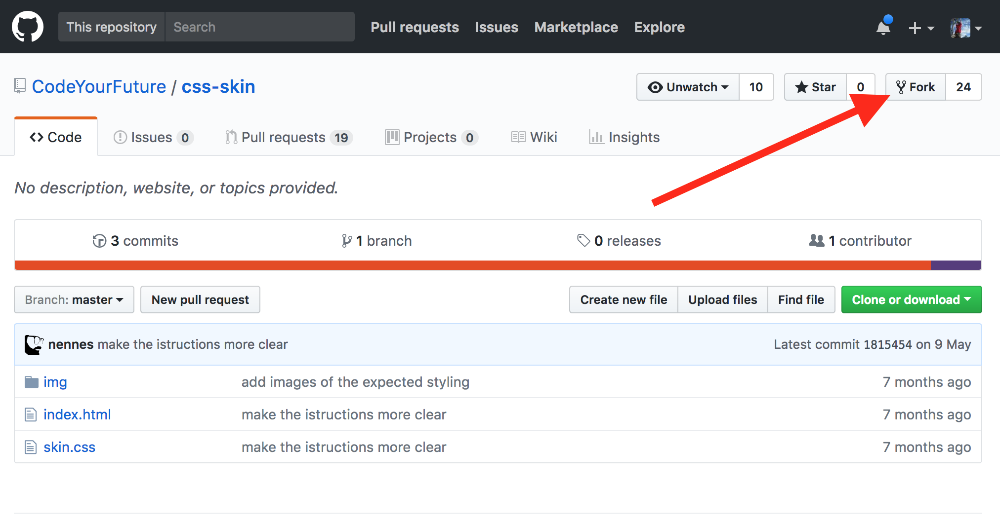
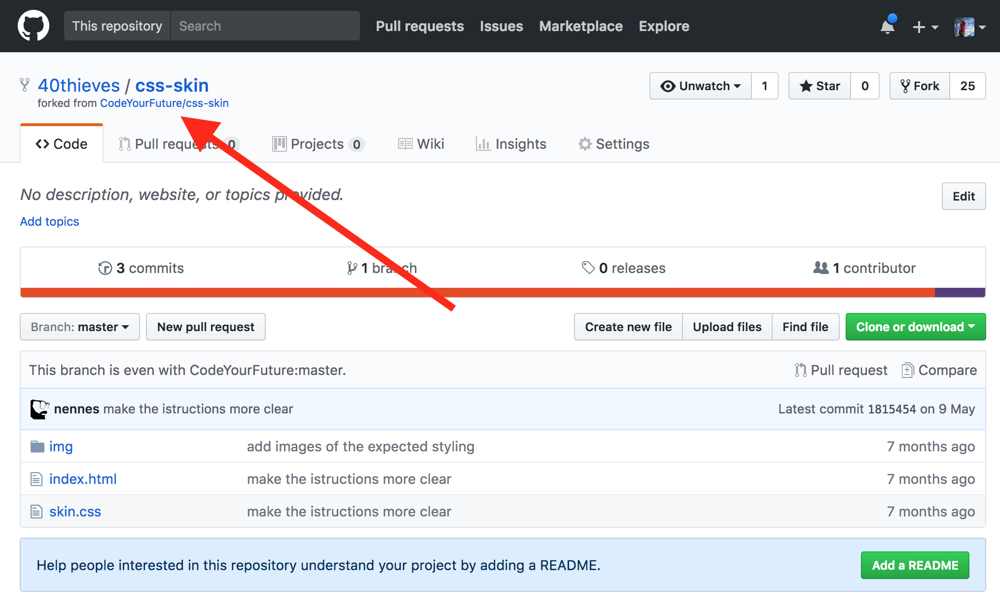
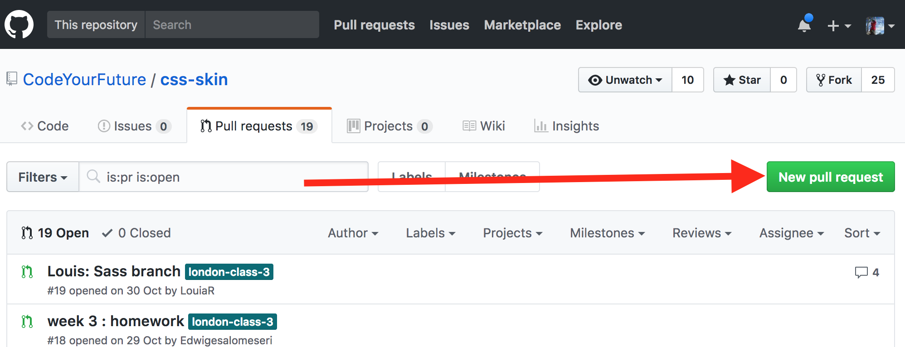
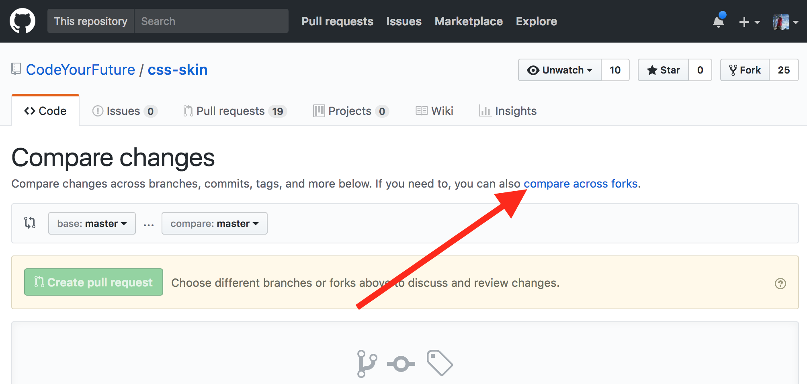
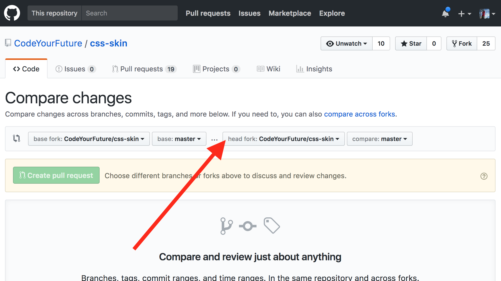
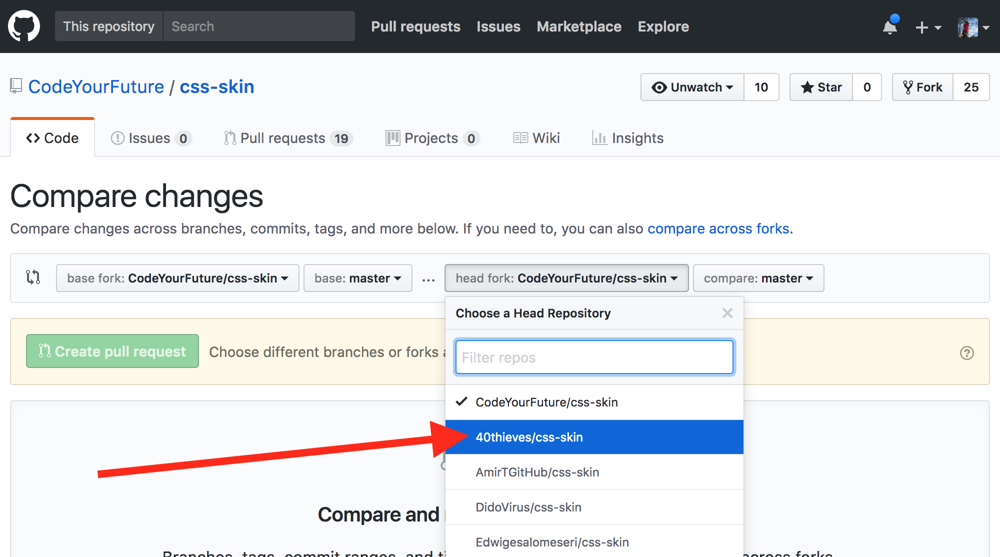
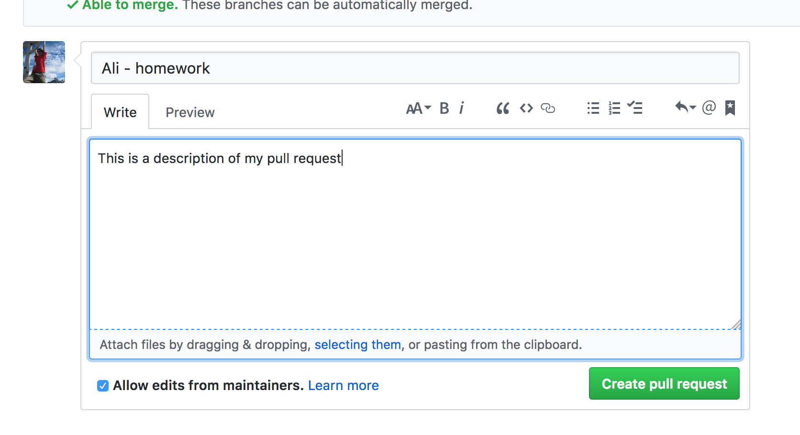
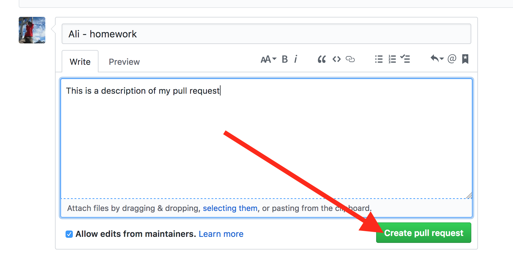
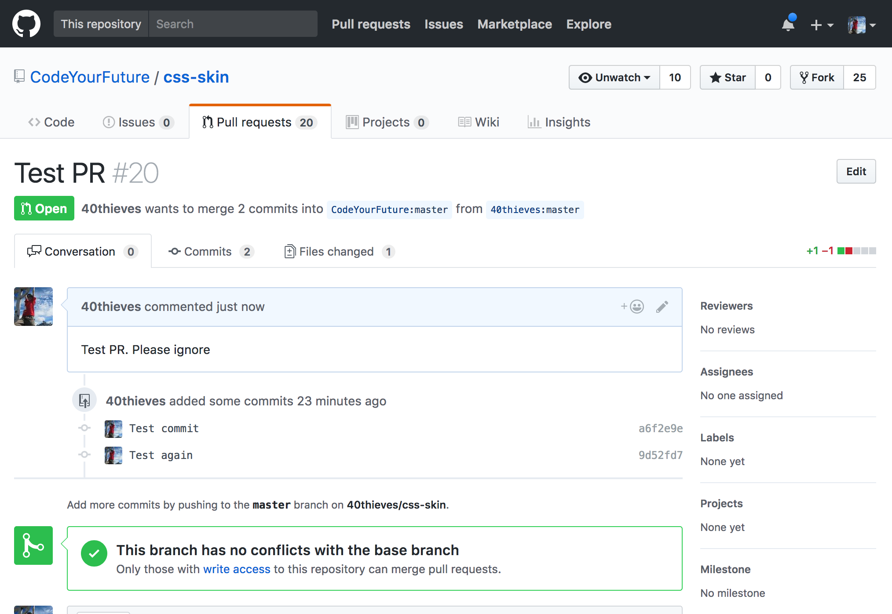

# Making a Pull Request


**What will we learn today?**

* [Why fork?](#why-fork)
* [What is a remote?](#what-is-a-remote)
* [How to fork a GitHub repo](#how-to-fork-a-github-repo)
* [Adding a remote](#adding-a-remote)
* [Creating a PR](#creating-a-pr)

## Why fork?

For many of the CodeYourFuture homework assignments, you will need to make a Pull Request to a GitHub repository. By default GitHub repos prevent most people from pushing to them. This is ensure that repo owners have control over the project.

This doesn't mean you will never be able to make changes to the repo! On GitHub you do this by creating a "fork". A fork is an exact copy of the original repo but copied to your own GitHub account. This means that now you can push to it!

This is why you will need to create a fork when submitting a PR for your homework.

## What is a remote?

Git has a concept of a "remote". These are other git repositories that can be connected to over the internet. You can push or pull code changes from them. Remotes have a *name* and a *URL*. Most of the remotes that you will use at CYF are hosted on GitHub, so have a github.com URL.

When you clone a repo from GitHub, the default remote is named `origin` and the URL is set to that of the GitHub repo.

You can view the remotes you have set up with:

```
git remote -v
```

## How to fork a GitHub repo

Firstly you need to click the "Fork" button:



Then you should be brought to your new fork (notice how the repo title changes):



Now you can clone from your fork by copying the URL here:


The command to clone is:

```
git clone URL_YOU_JUST_COPIED
```

## Adding a Remote

Follow these instructions if you are getting an permission error when pushing your changes. If you have cloned the original repo *before* forking, you'll need to follow these instructions. You can check this by running `git remote -v`. If the output looks something like:

```
origin git@github.com:CodeYourFuture/css-skin.git (fetch)
origin git@github.com:CodeYourFuture/css-skin.git (push)
```

then you have cloned before forking. The key is that the `origin` remote is pointing to a CodeYourFuture URL. Don't worry, we can fix it!

The first step is to fork the original repo. Follow the first 2 steps from [forking instructions](#how-to-fork-a-github-repo) above.

Now, instead of cloning the fork (you have already cloned), you need to add it as a remote.

Run:

```
git remote add fork URL_YOU_COPIED_FROM_FORK
```

This will add a new remote called `fork` that points to your new fork. To check this, run `git remote -v` again. You should see both the `origin` and `fork` remotes.

Now that you have your `fork` remote you can push to it (instead of the `origin` remote, which will error) by running:

```
git push fork
```

You'll need to remember to add the `fork` *every time you push*.

## Creating a PR

So you've done your homework, you've committed your changes and are ready to make a PR. Congrats! 🎉🎉🎉

At this point you should have followed the instructions either to [fork the original repo](#how-to-fork-a-github-repo) or [added a remote to your fork](#adding-a-remote). If you haven't make sure you read those sections first.

You will need to push to your fork. If you forked and then cloned (as in the [how to fork instructions](#how-to-fork-a-github-repo)) then you just need to run `git push`. If you [added a remote to your fork](#adding-a-remote), then you will need to run `git push fork`.

Next you need to go the original repo in your browser (probably starting with https://github.com/CodeYourFuture). Next click the Pull Requests tab:


Then click the New pull request button:



Then click the "compare across forks" link:



Then click the "head fork" dropdown button:



Then find your fork in the list and click it:



Then click the Create pull request button:


Almost there! Now fill out the PR form. Give it a sensible title and an (optional) description:



And finally click the Create pull request button at the bottom of the form:



That's it! You created your PR!



## Resources

1. [Creating a pull request from a fork](https://help.github.com/articles/creating-a-pull-request-from-a-fork/)
