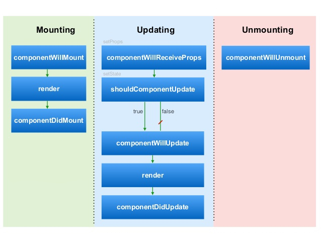

# React 3


**What will we learn today?**

- [Recap](#recap)
- [Unmounting](#unmounting)
- [The Circle of Life](#the-circle-of-life)
- [Fetching Data in React](#fetching-data-in-react)
- [Default Props](#default-props)
- [Refs](#refs)

## Recap

Last week we looked at using props and state to create React components that change with user input ([interactive example](https://stackblitz.com/edit/react-pezgpe)):

```js
class Counter extends Component {
  constructor(props) {
    super(props)
    this.state = { count: 0 }
  }

  increment = () => {
    this.setState({ count: ++this.state.count })
  }

  render() {
    return (
      <div>
        Count: {this.state.count}
        <button onClick={this.increment}>Click me!</button>
      </div>
    )
  }
}
```

## Unmounting

So far we've looked at components that are always rendered in the browser. However (and this is often the case in large applications), we might want to control whether components are shown or not. Let's look at a Toggle component ([interactive example](https://stackblitz.com/edit/react-ldakkv)):

```js
const IsShown = () => (
  <p>I'm shown when true ✅</p>
)
const IsNotShwon = () => (
  <p>I'm shown when false ☑️</p>
)

class Toggle extends Component {
  constructor(props) {
    super(props)
    this.state = { isShown: false }
  }

  toggle = () => {
    this.setState({ isShown: !this.state.isShown })
  }

  render() {
    return (
      <div>
        {this.state.isShown ? <IsShown /> : <IsNotShown />}
        <button onClick={this.toggle}>Toggle</button>
      </div>
    )
  }
}
```

If you open up dev tools, you will see that the element changes based on the `isShown` state. The hidden element is not hidden with CSS, it is actually removed from the DOM. This is important in larger applications as it can free up resources (CPU & memory) that aren't being used any more.

## The Circle of Life

When a component is within the DOM, we call it *mounted*. When a component is removed from the DOM, we call it *unmounted*. When we change state like in the unmounting example above, we can switch between these statuses. This gives us a clue that components go through a *lifecycle* of different statuses. We have seen 2 of the statuses: mounting and unmounting, there is also a third called *updating*.

We can hook into this lifecycle through special component methods that are added by React's `Component` class. They are run at different points of the lifecycle, often before and after they change to a different status. The method names are contain `will` or `did` based on whether they run before or after a status change.

This diagram shows the React component lifecycle:



Let's look at how we can use one of the lifecycle methods ([interactive example](https://stackblitz.com/edit/react-sf6spn)):

```js
class Lifecycle extends Component {
  componentDidMount() {
    console.log('componentDidMount')
  }

  render() {
    return <div>Hello World</div>
  }
}
```

> **Exercise:**
> Open the `my-hotel` application from the last 2 weeks
> 1. Implement the lifecycle hook methods in the `BookingsMessage` component and add a `console.log` to each of them. Try interacting with the component and see what order the logs appear
> 2. The `componentWillUnmount` method will never be called. Can you explain why?
> 3. Return `false` from `shouldComponentUpdate` in `BookingsMessage`. Try incrementing the number of bookings and explain what happens (change it back to return `true` after you are done!)

We'll now focus on a few of the lifecycle hooks and see how they are used.

### `shouldComponentUpdate`

This method runs when a component's props have changed, which would normally trigger a re-render. I say normally because this lifecycle hook lets us control whether the component should update (or re-render). If you want the component to render, then the method should return `true`. If not, then it should return `false`.

Why would we want to prevent a component from re-rendering? In some circumstances, it can be used to improve performance. If you have a component that is re-rendering *a lot* and it doesn't really need to, then returning false from `shouldComponentUpdate` is a good way to improve performance.

### `componentDidMount` and `componentWillUnmount`

The `componentDidMount` method runs after a component has finished rendering to the DOM. The component is now waiting for a props change or input from the user. It is called only once. We use this lifecycle hook to make changes outside of the component (sometimes these are called *side effects*).

The `componentWillUnmount` method runs when a component has been unmounted from the DOM. It is used to "clean up" the component as it is no longer being shown. Often we need to close down or cancel the changes we made in `componentDidMount`.

To look at these in more detail, we'll create a Clock component in an exercise.

> **Exercise:**
> Open the `my-hotel` React application from last week
> 1. Create a new `Clock` component and copy/paste in the code below ([interactive version](https://stackblitz.com/edit/react-7zvt98)):

```js
class Time extends Component {
  constructor(props) {
    super(props)
    this.state = { date: new Date() }
  }
  render() {
    return (
      <div>{this.state.date.toLocaleTimeString()}</div>
    )
  }
}
class Clock extends Component {
  constructor(props) {
    super(props)
    this.state = { isShowingClock: true }
  }
  toggle = () => this.setState({ isShowingClock: !this.state.isShowingClock })
  render() {
    return (
      <div>
        {this.state.isShowingClock && <Time />}
        <button onClick={this.toggle}>Toggle time</button>
      </div>
    )
  }
}
```

> 2. Render the `Clock` component in the `App` component
> 4. Add a `componentDidMount` method to the `Time` component and use `setInterval` to call `this.tick` every second (1000 milliseconds)
> 5. Implement the `tick` method, and set the `date` state to the current date (hint: `new Date()`)
> 6. Add a `console.log` to the `tick` method. Try clicking the "Toggle time" button and look at what happens in the console. What do you think the problem is here? How can we fix it?
> 7. Assign the return value of `setInterval` to `this.timer`
> 8. In `componentWillUnmount`, remove the timer by calling `clearInterval(this.timer)`
> 9. Try playing around with the toggle, like in step 6. How have we solved the problem?

## Fetching Data in React

Most web applications will load data from the server. How do we do this in React? The component lifecycle is very important - we don't want to be calling our API at the wrong time, or multiple times with the same data!

If we tried to fetch data in our `render` method, it would make a request every time props or state changed. This would create lots of unnecessary requests. As we saw above, `componentDidMount` is called only once when the component is first rendered and so it is an ideal place for making requests. Let's look at an example:

```js
class PokemonFetcher extends Component {
  componentDidMount() {
    fetch(`https://pokeapi.co/api/v2/pokemon/${this.props.id}`)
  }
  render() {
    // const name = ???
    return <div>Pokemon name: {name}</div>
  }
}
```

This example isn't very useful! We can't use the data returned from the server in `render` because the request is asynchronous :( We need React to re-render once the request is resolved - a perfect use for state! Let's look at an example ([interactive example](https://stackblitz.com/edit/react-e6rvtz))

```js
class PokemonFetcher extends Component {
  constructor(props) {
    super(props)
    this.state = { name: null }
  }

  componentDidMount() {
    fetch(`https://pokeapi.co/api/v2/pokemon/${this.props.id}`)
      .then((res) => res.json())
      .then((data) => {
        this.setState({ name: data.name })
      })
  }

  render() {
    return <div>Pokemon name: {this.state.name}</div>
  }
}
```

Now we can see the name of the Pokemon that we fetched from the server!

However we have a bit of a problem - when we first render the component, we don't have the Pokemon's name yet. We first have to initialise it to `null` in the constructor. This shows us that we're missing something from our UI - a *loading status*.

Let's look at showing a different UI when the request is loading ([interactive example](https://stackblitz.com/edit/react-j86faz)):

```js
class PokemonFetcher extends Component {
  constructor(props) {
    super(props)
    this.state = {
      isLoading: true,
      name: null
    }
  }

  componentDidMount() {
    fetch(`https://pokeapi.co/api/v2/pokemon/${this.props.id}`)
      .then((res) => res.json())
      .then((data) => {
        this.setState({
          isLoading: false,
          name: data.name
        })
      })
  }

  render() {
    if (this.state.isLoading) {
      return <div>Loading... 🤔</div>
    } else {
      return <div>Pokemon name: {this.state.name}</div>
    }
  }
}
```

Here are the steps that the component takes:

- Initialise `isLoading` to `true`
- In `render`, show a loading message because `isLoading` is true
- Once rendered, `componentDidMount` will trigger the API request
- When the request resolves, we set the `isLoading` state to false and set the data that we want
- Changing state triggers a re-render, and because `isLoading` is false we render out the Pokemon's name

We can still improve our component! What happens if we make a request that fails? Our request will error, but we won't show the error in the browser. Let's see how we can fix it ([interactive example](https://stackblitz.com/edit/react-cukrzr)).

First we have to deal with annoying quirk of `fetch` - it doesn't reject the promise on HTTP errors. We can fix this by adding another `.then` before we convert to JSON:

```js
.then((res) => {
  if (res.status >= 200 && res.status < 300) {
    return res
  } else {
    throw new Error('HTTP error')
  }
})
```

Now we can add our solution - a `.catch` on the `fetch` call. Here we reset the loading state and add the error to state.

```js
.catch((err) => {
  this.setState({
    isLoading: false,
    err: err
  })
})
```

Now we can check if there's an error in state and render out an error message:

```js
render() {
  if (this.state.isLoading) {
    return <div>Loading... 🤔</div>
  } else if (this.state.err) {
    return <div>Something went wrong 😭</div>
  } else {
    return <div>Pokemon name: {this.state.name}</div>
  }
}
```

> **Exercise:**
> Open your `my-hotel` application again

> Convert the `SpecialDeals` component to fetch data from http://www.mocky.io/v2/5a9ad31d3400002c00a39a3c.
> Make sure that you include a loading state and error handling.

## Refs

As we have seen, React manages the DOM for us. That means we generally don't have to worry about keeping track of DOM nodes, or manipulating them directly. However sometimes you need to be able to access a DOM node that React is managing. Some common use cases are managing browser focus and integrating with third party libraries like a jQuery plugin.

We can do this with a *ref*. Let's look at an example that will change browser focus to an input when a button is clicked ([interactive example](https://stackblitz.com/edit/react-nbezfm)):

```js
class InputFocuser extends Component {
  setInputRef = (input) => {
    this.input = input
  }

  focusInput = () => {
    this.input.focus()
  }

  render() {
    return (
      <div>
        <input type="text" ref={this.setInputRef} />
        <button onClick={this.focusInput}>Focus</button>
      </div>
    )
  }
}
```

The key method here is `setInputRef`. It is called by React when rendering the `<input>`, and passes a reference to the real DOM node as an argument. We remember the reference by assigning it to `this.input`. Then when the button is clicked we can call the `focus` method (a vanilla method, not part of React) on the input DOM node.

# Homework


